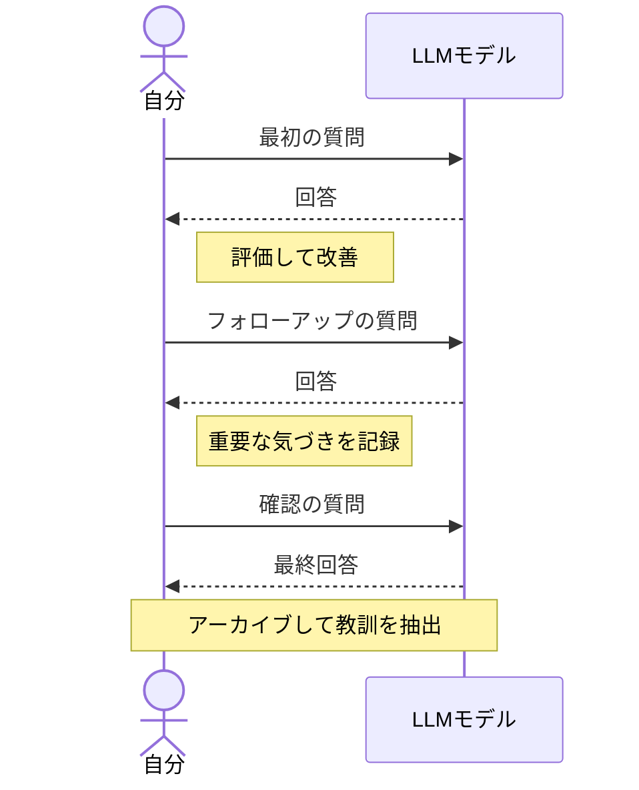

 

# AI会話アーカイブ

> [!TIP]
> LLMの回答を `Ctrl+Shift+V` で貼り付け（HTMLを自動でMarkdownに変換）。今日の日付は `Ctrl+;` で挿入。

---

## サマリー

**トピック:** [会話の一行説明]

**所要時間:** [おおよそのターン数または所要時間]

**成果:** [何を持ち帰りましたか？]

## 会話フロー

> *全体像 ― 不要なら削除してください。*

## 主なトピック

- [議論した最初の主要トピック]
- [2番目のトピック]
- [3番目のトピック]

## 注目すべきやり取り

### [このやり取りのトピック]

> **質問:** [あなたの質問やプロンプト]

> **回答:** [LLMの回答、要点を抜粋]

**自分の見解:** [あなたの反応 — 同意した、反対した、検証が必要？]

### [2番目のやり取りのトピック]

> **質問:** [あなたの質問]

> **回答:** [LLMの回答]

**自分の見解:** [あなたの反応]

> [!NOTE]
> 何かを学んだやり取り、後で参照しそうなやり取りだけをアーカイブしましょう。つなぎのやり取りは省略してOK。

## 学んだこと

| # | 学び | 検証済み？ |
|---|------|------------|
| 1 | [会話から得た重要な洞察] | はい / いいえ / 一部 |
| 2 | [もう一つの洞察] | はい / いいえ / 一部 |

## フォローアップ

- [ ] [まだ答えが出ていない質問]
- [ ] [別の情報源で検証すべきこと]
- [ ] [次に探るべき関連トピック]

---

*Mark It Downで作成*
