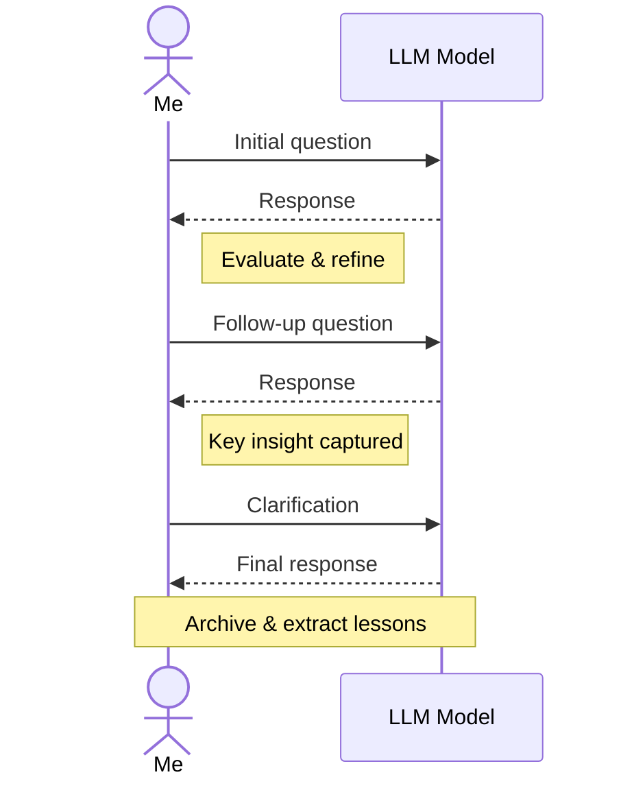

 

# AI Conversation Archive

> [!TIP]
> Paste LLM responses with `Ctrl+Shift+V` (auto-converts HTML to Markdown). Insert today's date with `Ctrl+;`.

---

## Summary

**Topic:** [One-line description of the conversation]

**Duration:** [Approximate number of turns or time spent]

**Outcome:** [What did you walk away with?]

## Conversation Flow

> *Visual overview — delete this section if not needed.*

## Key Topics

- [First major topic discussed]
- [Second topic]
- [Third topic]

## Notable Exchanges

### [Topic of this exchange]

> **Q:** [Your question or prompt]

> **A:** [The LLM's response, trimmed to the essential part]

**My take:** [Your reaction — did you agree, disagree, need to verify?]

### [Topic of second exchange]

> **Q:** [Your question]

> **A:** [LLM response]

**My take:** [Your reaction]

> [!NOTE]
> Only archive exchanges that taught you something or that you might reference later. Skip the filler.

## Lessons Learned

| # | Lesson | Verified? |
|---|--------|-----------|
| 1 | [Key insight from the conversation] | Yes / No / Partially |
| 2 | [Another insight] | Yes / No / Partially |

## Follow-up Questions

- [ ] [Question you still need to answer]
- [ ] [Something to verify with another source]
- [ ] [Related topic to explore next]

---

*Captured with Mark It Down*
