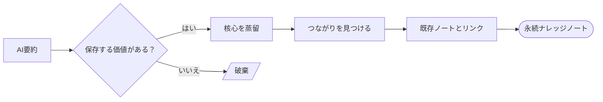

 

# [ナレッジトピック]

> [!TIP]
> 関連ノートは `Ctrl+K` で検索。`Ctrl+;` で今日の日付を挿入。「つながり」セクションで関連トピックをリンクして、ナレッジグラフを構築しましょう。

---

## ナレッジフロー

> *全体像 ― 不要なら削除してください。*

## ソース

| 項目 | 値 |
|------|-----|
| **元の情報源** | [記事、書籍、動画、または会話] |
| **使用AIモデル** | [モデル名とバージョン] |
| **要約日** | [YYYY-MM-DD] |
| **確信度** | 高 / 中 / 低 |

## AI要約

> [AI生成の要約をここに引用として貼り付けてください。これが下で蒸留する原材料です。]

## 蒸留した洞察

[核心を自分の言葉で書いてください。重要なことを捉える2〜5文を目指しましょう。凝縮できないなら、まだ理解できていないかもしれません。]

例:

コネクションプーリングはクエリごとの速度ではなく、負荷時のリソース枯渇を防ぐことが目的です。プールサイズはアプリケーションインスタンス数で割ったデータベースの `max_connections` に合わせるべきで、同時接続ユーザー数ではありません。

> [!NOTE]
> 良い蒸留された洞察は、元の情報源を読まなくても役に立つものです。

## つながり

- [ナレッジベース内の関連ノートや概念]
- [別の関連トピック]
- [矛盾または支持: 別のノートへの参照]

## 未解決の質問

- [ ] [要約を読んだ後もまだ不明な点は？]
- [ ] [これに頼る前に検証すべきことは？]
- [ ] [次に探るべき隣接トピックは？]

---

*Mark It Downで作成*
