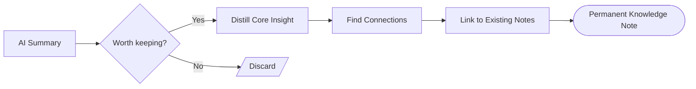

 

# [Knowledge Topic]

> [!TIP]
> Find connected notes with `Ctrl+K`. Insert today's date with `Ctrl+;`. **Paste AI output with `Ctrl+Shift+V`.** Link related topics in the Connections section to build your knowledge graph.

---

## Knowledge Flow

> *Visual overview — delete this section if not needed.*

## Source

| Field | Value |
|-------|-------|
| **Original source** | [Article, book, video, or conversation] |
| **AI model used** | [Model name and version] |
| **Date summarized** | [YYYY-MM-DD] |
| **Confidence** | High / Medium / Low |

## AI Summary

> [Paste the AI-generated summary here as a blockquote. This is the raw material you will distill below.]

## Distilled Insight

[Write the core idea in your own words. Aim for 2-5 sentences that capture what matters. If you cannot condense it, you may not understand it yet.]

For example:

Connection pooling is not about speed per query — it is about preventing resource exhaustion under load. The pool size should match your database's `max_connections` divided by the number of application instances, not the number of concurrent users.

> [!NOTE]
> A good distilled insight should be useful even without reading the original source.

## Connections

- [Related note or concept in your knowledge base]
- [Another related topic]
- [Contradicts or supports: reference to another note]

## Open Questions

- [ ] [What is still unclear after reading the summary?]
- [ ] [What would you need to verify before relying on this?]
- [ ] [What adjacent topic should you explore next?]

---

*Captured with Mark It Down*
