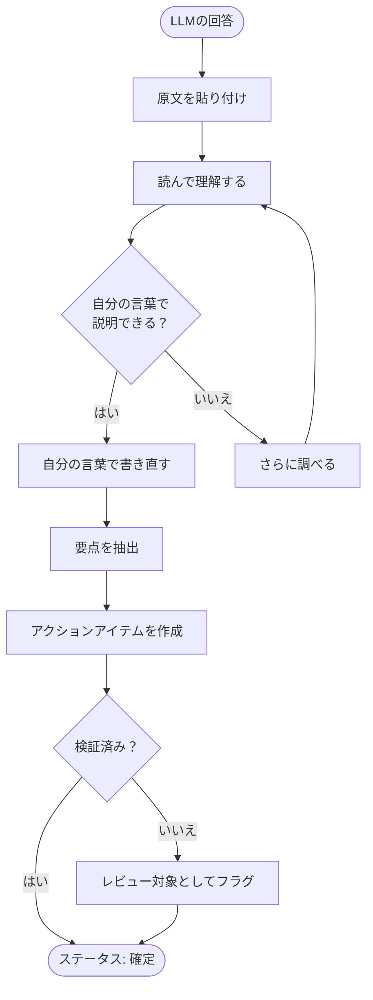

  

# ChatGPT出力オーガナイザー

> [!TIP]
> LLMの出力を `Ctrl+Shift+V` で貼り付け（自動でMarkdownに変換）。日付入力は `Ctrl+;`。再利用可能なテンプレートとして保存するには `Alt+T`。

---

## 処理フロー

> *全体像 ― 不要なら削除してください。*

## コンテキスト

**質問した内容:** [LLMに何を聞きましたか？]

**質問した理由:** [どんな問題を解決しようとしていましたか？]

**会話の日付:** [YYYY-MM-DD]

> [!NOTE]
> 質問の意図を記録しましょう。同じ質問でも聞き方を変えると、まったく異なる出力が得られます。

## 原文（LLMの出力）

> [LLMの回答全文をここに引用として貼り付けてください。比較のため編集せずそのまま残します。]

## 自分の言葉での書き直し

[LLMの出力を自分の言葉で書き直してください。このセクションが最も重要です — ただ保存するのではなく、内容を理解することが目的です。]

## 主な気づき

| # | 気づき | 確信度[^1] |
|---|--------|------------|
| 1 | [最も重要な洞察] | 高 / 中 / 低 |
| 2 | [2番目の洞察] | 高 / 中 / 低 |
| 3 | [3番目の洞察] | 高 / 中 / 低 |

> [!TIP]
> 確信度が「低」の場合、行動する前に別の情報源で確認するべきというサインです。

## 変更した箇所

| 原文の主張 | 自分の表現 | 変更理由 |
|------------|------------|----------|
| [LLMはXと言った] | [自分はYと書いた] | [理由: 不正確/曖昧すぎ/文脈不足] |
| [LLMはAと言った] | [自分はBと書いた] | [理由] |

## アクションアイテム

- [ ] [この出力に基づく最初の具体的なアクション]
- [ ] [2番目のアクション]
- [ ] [上記の「確信度: 低」の主張を検証]
- [ ] 検証後にステータスを `reviewed` に更新
- [ ] 完全に統合したらステータスを `final` に更新

## 振り返り

**LLMが正しかった点は？** [回答の強み]

**LLMが間違っていた点・不足していた点は？** [ギャップ、ハルシネーション、過度な単純化]

**まだ理解できていない点は？** [フォローアップすべき質問]

[^1]: 確信度はLLMが述べた確信度ではなく、自分自身の検証後にその主張をどれだけ信頼できるかを反映します。

---

*Mark It Downで作成*
