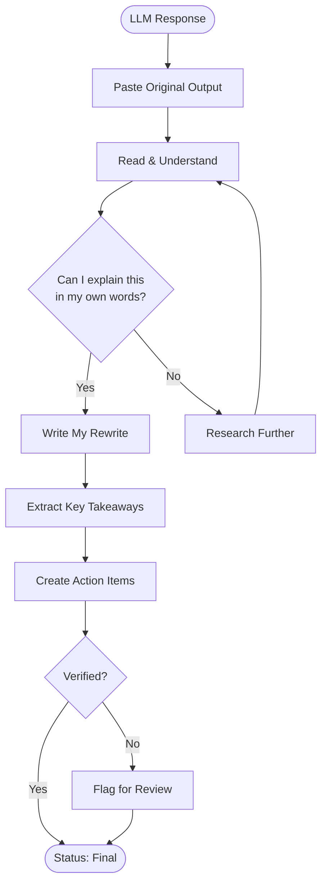

  

# LLM Output Organizer

> [!TIP]
> Paste LLM output with `Ctrl+Shift+V` (auto-converts to Markdown). Date entries with `Ctrl+;`. Save as reusable template with `Alt+T`.

---

## Processing Flow

> *Visual overview — delete this section if not needed.*

## Context

**Question I asked:** [What did you ask the LLM?]

**Why I asked:** [What problem were you trying to solve?]

**Date of conversation:** [YYYY-MM-DD]

> [!NOTE]
> Capture the intent behind your query. The same question asked differently produces very different outputs.

## Original Output

> [Paste the full LLM response here as a blockquote. Keep it unedited for comparison.]

## My Rewrite

[Rewrite the LLM output in your own words. This is the most important section — it forces you to understand the material rather than just saving it.]

## Key Takeaways

| # | Takeaway | Confidence[^1] |
|---|----------|----------------|
| 1 | [Most important insight] | High / Medium / Low |
| 2 | [Second insight] | High / Medium / Low |
| 3 | [Third insight] | High / Medium / Low |

> [!TIP]
> If your confidence is "Low," that is a signal to verify with a second source before acting on it.

## What I Changed

| Original claim | My version | Why I changed it |
|----------------|------------|------------------|
| [LLM said X] | [I wrote Y] | [Reason: was inaccurate / too vague / missing context] |
| [LLM said A] | [I wrote B] | [Reason] |

## Action Items

- [ ] [First concrete action to take based on this output]
- [ ] [Second action]
- [ ] [Verify any "Low confidence" claims above]
- [ ] Update status to `reviewed` after verification
- [ ] Update status to `final` when fully integrated

## Reflection

**What did the LLM get right?** [Strengths of the response]

**What did it get wrong or miss?** [Gaps, hallucinations, or oversimplifications]

**What do I still not understand?** [Questions to follow up on]

[^1]: Confidence reflects how much you trust the claim after your own verification, not the LLM's stated confidence.

---

*Captured with Mark It Down*
