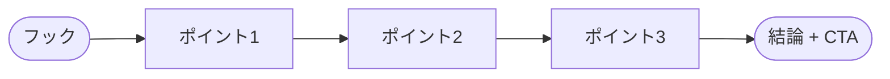

  

# ブログ記事の下書き

> [!TIP]
> まずフックから始め、ポイントを展開し、最後にCTA（行動喚起）でまとめましょう。
> 他のソースからのコンテンツは `Ctrl+Shift+V`（Smart Paste）で貼り付けると自動でMarkdownに変換。公開準備ができたら `Ctrl+Shift+E` でPDF/HTML/DOCXにエクスポート。

---

## フック

[読者の注意を引く冒頭のパラグラフを書いてください。驚きの事実、大胆な主張、または共感できる問題でリードしましょう。]

> [!TIP]
> 優れたフックは一つの質問に答えます: 「なぜ読者は今これを気にすべきか？」

## 記事の構成

> *全体像 ― 不要なら削除してください。*

## 本文

### ポイント1

[最初の主張や洞察を述べる]

[裏付けとなる根拠や説明]

> [このセクションの印象的な引用やキーテイクアウェイ]

### ポイント2

[2番目の主張や洞察を述べる]

[裏付けとなる根拠や説明]

### ポイント3

[3番目の主張や洞察を述べる]

[裏付けとなる根拠や説明]

## 結論

[主なテイクアウェイを2〜3文でまとめてください。なぜこれが重要かを再述。]

## 行動喚起（CTA）

**読者は次に何をすべきか？** [購読、試す、共有、コメントなど]

## 公開チェックリスト

- [ ] 文法と明瞭さを校正
- [ ] SEOタイトルとメタディスクリプションを追加
- [ ] アイキャッチ画像とalt属性を含める
- [ ] ソーシャルプレビューカード（OG画像、説明）を設定
- [ ] 関連する内部/外部リンクを追加
- [ ] スケジュールまたは公開

---

*Mark It Downで作成*
