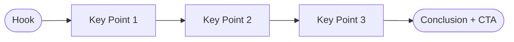

  

# Blog Post Draft

> [!TIP]
> Start with the Hook, expand Key Points, then wrap up with a Call to Action.
> Use `Ctrl+Shift+E` to export as PDF/HTML/DOCX when ready to publish.

---

## Hook

[Write an opening paragraph that grabs the reader's attention. Lead with a surprising fact, a bold claim, or a relatable problem.]

> [!TIP]
> Great hooks answer one question: "Why should the reader care right now?"

## Article Structure

> *Visual overview — delete this section if not needed.*

## Main Body

### Key Point 1

[State your first argument or insight]

[Supporting evidence or explanation]

> [Memorable quote or key takeaway from this section]

### Key Point 2

[State your second argument or insight]

[Supporting evidence or explanation]

### Key Point 3

[State your third argument or insight]

[Supporting evidence or explanation]

## Conclusion

[Summarize the main takeaway in 2-3 sentences. Restate why this matters.]

## Call to Action

**What should the reader do next?** [Subscribe, try something, share, comment, etc.]

## Publishing Checklist

- [ ] Proofread for grammar and clarity
- [ ] Add SEO title and meta description
- [ ] Include a featured image and alt text
- [ ] Set social preview card (OG image, description)
- [ ] Add internal/external links where relevant
- [ ] Schedule or publish

---

*Captured with Mark It Down*
