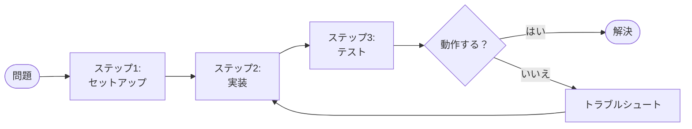

  

# 技術記事

> [!TIP]
> まず問題を定義し、次に解決策をステップバイステップで解説しましょう。
> コードやコンテンツは `Ctrl+Shift+V`（Smart Paste）で貼り付け。`Ctrl+Shift+P` でスラッシュメニュー（コードブロック、コールアウト）、`Ctrl+Shift+E` でエクスポート。

---

## 問題

[何を解決するのか？なぜ重要か？]

## 解決策

[アプローチの概要。詳細に入る前に、解決策を一段落で説明。]

## 前提条件

- [ツールや依存関係、例: Node.js 20+]
- [必要な知識、例: Gitの基本的な操作]
- [必要なアクセスやアカウント]

## プロセスの概要

> *全体像 ― 不要なら削除してください。*



## ステップバイステップ

### ステップ1 — 環境をセットアップ

[何をするか説明]

```bash
# 例: 依存関係をインストール
npm install
```

**期待される結果:** [このステップ後に見えるべきもの]

### ステップ2 — [アクションタイトル]

[何をするか説明]

```
[コードまたは設定のスニペット]
```

### ステップ3 — [アクションタイトル]

[何をするか説明]

### ステップ4 — 動作を確認

[解決策が機能していることをどう確認するか]

## 注意点

> [!NOTE]
> [よくある落とし穴 #1 とその回避方法]

> [!TIP]
> [よくある落とし穴 #2 と推奨される回避策]

## まとめ

| 項目 | 詳細 |
|------|------|
| **問題** | [一行の再説明] |
| **解決策** | [一行の再説明] |
| **キーテイクアウェイ** | [最も重要なこと] |

---

*Mark It Downで作成*
