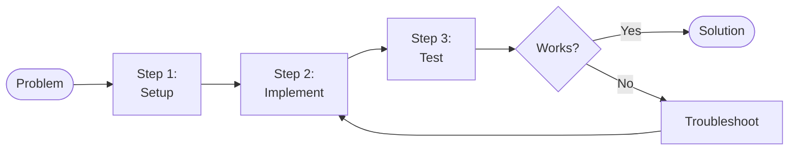

  

# Technical Article

> [!TIP]
> Define the Problem, then walk through the Solution step by step.
> Use `Ctrl+Shift+P` for slash menu (code blocks, callouts) and `Ctrl+Shift+E` to export.

---

## Problem

[What problem are we solving? Why does it matter?]

## Solution

[High-level overview of the approach. One paragraph describing the solution before diving into details.]

## Prerequisites

- [Tool or dependency, e.g., Node.js 20+]
- [Required knowledge, e.g., basic familiarity with Git]
- [Access or accounts needed]

## Process Overview

> *Visual overview — delete this section if not needed.*



## Step-by-step

### Step 1 — Set up the environment

[Describe what to do]

```bash
# Example: install dependencies
npm install
```

**Expected result:** [What the reader should see after this step]

### Step 2 — [Action title]

[Describe what to do]

```
[Code or configuration snippet]
```

### Step 3 — [Action title]

[Describe what to do]

### Step 4 — Verify it works

[How to confirm the solution is working]

## Gotchas

> [!NOTE]
> [Common pitfall #1 and how to avoid it]

> [!TIP]
> [Common pitfall #2 and the recommended workaround]

## Summary

| What | Details |
|------|---------|
| **Problem** | [One-line restatement] |
| **Solution** | [One-line restatement] |
| **Key takeaway** | [The most important thing to remember] |

---

*Captured with Mark It Down*
