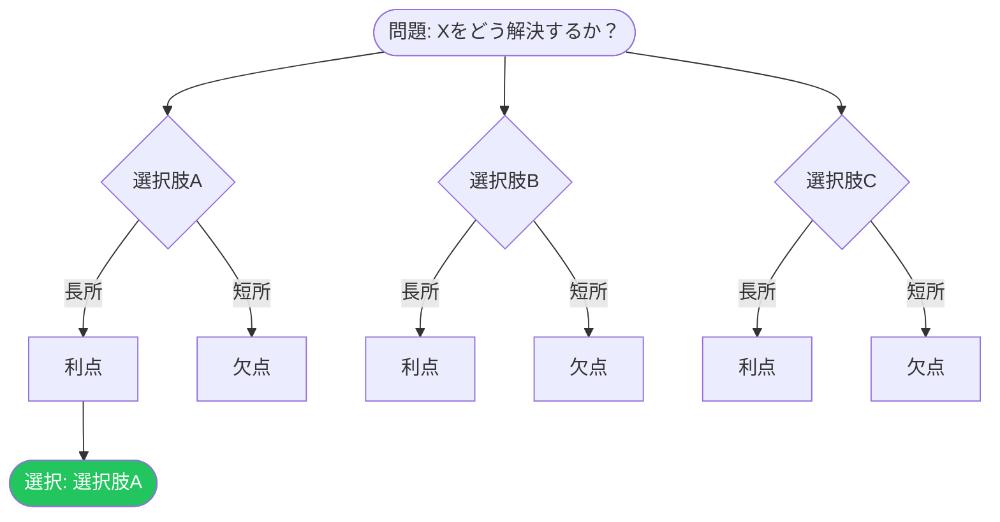

 

# ADR-[番号]: [決定タイトル]

> [!TIP]
> 重要な技術的決定ごとに1つのADRを作成。ステータス、コンテキスト、決定を最初に記入。
> `Ctrl+Shift+P` で技術的な詳細のコードブロックを挿入。

## ステータス

**[提案中 | 承認済み | 非推奨 | 置き換え済み]**

> [!NOTE]
> 置き換え済みの場合、置き換え先のADRをリンク: [ADR-XXX](./adr-xxx.md) に置き換え

## コンテキスト

[状況と作用している力を記述してください。問題や機会は何か？どんな制約があるか？]

## 決定

[決定を明確かつ簡潔に述べてください。能動態を使用。]

> [!TIP]
> 良い決定文は「我々は…する」で始まり、1〜3文です。

## 結果

### ポジティブ

- データベースのラウンドトリップを5から1に減らし、**パフォーマンスを改善**
- 新しいチームメンバーにとってよりシンプルなメンタルモデル
- 既存のインフラ投資と整合

### ネガティブ

- [ネガティブな結果]
- [ネガティブな結果]

### ニュートラル

- [明確にポジティブでもネガティブでもないトレードオフや観察]

## 決定ツリー

> *全体像 ― 不要なら削除してください。*

## 検討した代替案

| 選択肢 | 長所 | 短所 |
|--------|------|------|
| [選択肢A] | [利点] | [欠点] |
| [選択肢B] | [利点] | [欠点] |
| [選択肢C] | [利点] | [欠点] |

代替案に関する追加コンテキスト

[代替案を却下した理由の詳細、ベンチマーク、概念実証の結果、または関連リサーチへのリンク]

---

*Mark It Downで作成*
