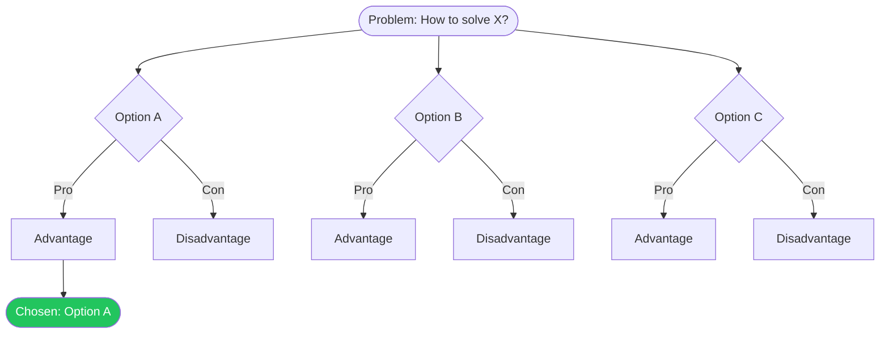

 

# ADR-[Number]: [Decision Title]

> [!TIP]
> One ADR per significant technical decision. Fill in Status, Context, and Decision first.
> Use `Ctrl+Shift+P` to insert code blocks for technical details.

## Status

**[Proposed | Accepted | Deprecated | Superseded]**

> [!NOTE]
> If superseded, link to the replacing ADR: Superseded by [ADR-XXX](./adr-xxx.md)

## Context

[Describe the situation and the forces at play. What is the problem or opportunity? What constraints exist?]

## Decision

[State the decision clearly and concisely. Use active voice.]

> [!TIP]
> A good decision statement starts with "We will..." and is one to three sentences.

## Consequences

### Positive

- **Improved performance** by reducing database round-trips from 5 to 1
- Simpler mental model for new team members
- Aligns with existing infrastructure investments

### Negative

- [Negative consequence]
- [Negative consequence]

### Neutral

- [Trade-off or observation that is neither clearly positive nor negative]

## Decision Tree

> *Visual overview — delete this section if not needed.*

## Alternatives Considered

| Option | Pros | Cons |
|--------|------|------|
| [Option A] | [Advantages] | [Disadvantages] |
| [Option B] | [Advantages] | [Disadvantages] |
| [Option C] | [Advantages] | [Disadvantages] |

Additional context on alternatives

[Longer discussion of why alternatives were rejected, benchmarks, proof-of-concept results, or links to relevant research]

---

*Captured with Mark It Down*
