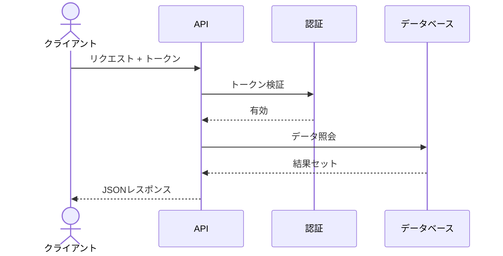

 

# APIドキュメント

> [!TIP]
> 各エンドポイントをH2セクションとしてドキュメント化してください。GET /usersの例パターンを複製しましょう。
> `Ctrl+Shift+P` でリクエスト/レスポンス例のコードブロックを挿入。

## 概要

[このAPIが提供する機能と想定する利用者の簡単な説明]

**ベースURL:**

```
https://api.example.com/v1
```

## 認証

すべてのリクエストには `Authorization` ヘッダーにBearerトークンが必要です:

```bash
curl -H "Authorization: Bearer YOUR_API_TOKEN" \
  https://api.example.com/v1/resource
```

> [!NOTE]
> トークンは [有効期間] 後に期限切れになります。`/auth/refresh` エンドポイントで新しいトークンを取得してください。

## リクエストフロー

> *全体像 ― 不要なら削除してください。*



## エンドポイント一覧

| メソッド | パス | 説明 |
|----------|------|------|
| `GET` | `/users` | 全ユーザー一覧 |
| `POST` | `/users` | 新規ユーザー作成 |
| `GET` | `/users/:id` | IDでユーザー取得 |
| `PUT` | `/users/:id` | ユーザー更新 |
| `DELETE` | `/users/:id` | ユーザー削除 |

## GET /users

オプションのフィルタリングとページネーション付きで全ユーザーを一覧表示。

### リクエスト

```bash
GET /users?page=1&limit=20&role=admin
```

**クエリパラメータ:**

| パラメータ | 型 | 必須 | 説明 |
|-----------|------|------|------|
| `page` | integer | いいえ | ページ番号（デフォルト: 1） |
| `limit` | integer | いいえ | 1ページあたりの件数（デフォルト: 20） |
| `role` | string | いいえ | ユーザーロールでフィルター |

### レスポンス

```json
{
  "data": [
    {
      "id": "usr_abc123",
      "name": "田中太郎",
      "email": "tanaka@example.com",
      "role": "admin",
      "created_at": "2026-01-15T09:30:00Z"
    }
  ],
  "meta": {
    "page": 1,
    "limit": 20,
    "total": 142
  }
}
```

## POST /users

[エンドポイントの説明]

### リクエスト

```json
[リクエストボディ]
```

### レスポンス

```json
[レスポンスボディ]
```

## GET /users/:id

[エンドポイントの説明]

### リクエスト

```bash
[リクエスト例]
```

### レスポンス

```json
[レスポンスボディ]
```

## エラーコード

| ステータス | コード | 説明 |
|-----------|--------|------|
| `400` | `INVALID_REQUEST` | [不正なリクエストボディまたはパラメータ] |
| `401` | `UNAUTHORIZED` | [認証情報の欠落または無効] |
| `403` | `FORBIDDEN` | [権限不足] |
| `404` | `NOT_FOUND` | [リソースが存在しない] |
| `429` | `RATE_LIMITED` | [リクエスト過多] |
| `500` | `INTERNAL_ERROR` | [予期しないサーバーエラー] |

> [!TIP]
> すべてのエラーレスポンスには、人間が読める説明の `message` フィールドが含まれます。

---

*Mark It Downで作成*
