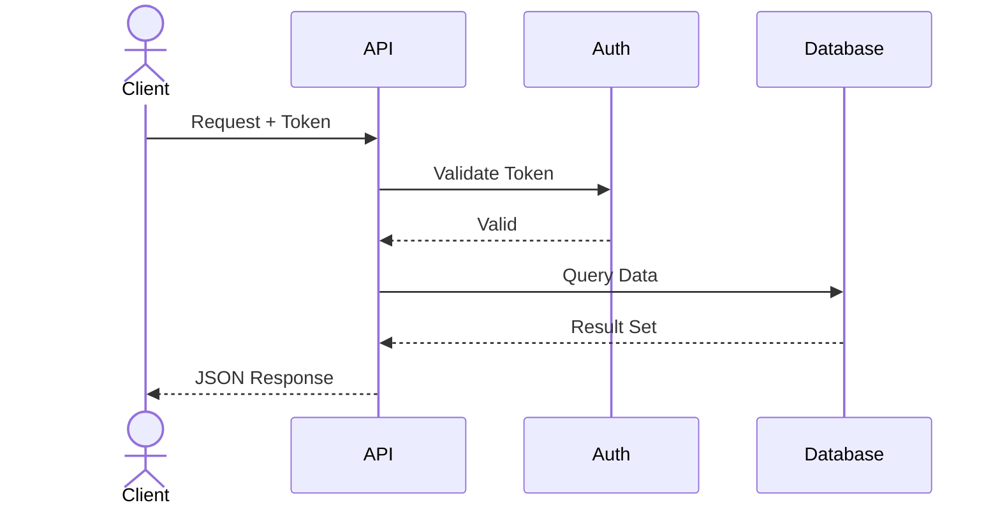

 

# API Documentation

> [!TIP]
> Document each endpoint as its own H2 section. Duplicate the GET /users example pattern.
> Use `Ctrl+Shift+P` to insert code blocks for request/response examples.

## Overview

[Brief description of what this API provides and its intended consumers]

**Base URL:**

```
https://api.example.com/v1
```

## Authentication

All requests require a Bearer token in the `Authorization` header:

```bash
curl -H "Authorization: Bearer YOUR_API_TOKEN" \
  https://api.example.com/v1/resource
```

> [!NOTE]
> Tokens expire after [duration]. Use the `/auth/refresh` endpoint to obtain a new token.

## Request Flow

> *Visual overview — delete this section if not needed.*



## Endpoints Overview

| Method | Path | Description |
|--------|------|-------------|
| `GET` | `/users` | List all users |
| `POST` | `/users` | Create a new user |
| `GET` | `/users/:id` | Get user by ID |
| `PUT` | `/users/:id` | Update a user |
| `DELETE` | `/users/:id` | Delete a user |

## GET /users

List all users with optional filtering and pagination.

### Request

```bash
GET /users?page=1&limit=20&role=admin
```

**Query Parameters:**

| Parameter | Type | Required | Description |
|-----------|------|----------|-------------|
| `page` | integer | No | Page number (default: 1) |
| `limit` | integer | No | Items per page (default: 20) |
| `role` | string | No | Filter by user role |

### Response

```json
{
  "data": [
    {
      "id": "usr_abc123",
      "name": "Jane Smith",
      "email": "jane@example.com",
      "role": "admin",
      "created_at": "2026-01-15T09:30:00Z"
    }
  ],
  "meta": {
    "page": 1,
    "limit": 20,
    "total": 142
  }
}
```

## POST /users

[Endpoint description]

### Request

```json
[Request body]
```

### Response

```json
[Response body]
```

## GET /users/:id

[Endpoint description]

### Request

```bash
[Request example]
```

### Response

```json
[Response body]
```

## Error Codes

| Status | Code | Description |
|--------|------|-------------|
| `400` | `INVALID_REQUEST` | [Malformed request body or parameters] |
| `401` | `UNAUTHORIZED` | [Missing or invalid authentication] |
| `403` | `FORBIDDEN` | [Insufficient permissions] |
| `404` | `NOT_FOUND` | [Resource does not exist] |
| `429` | `RATE_LIMITED` | [Too many requests] |
| `500` | `INTERNAL_ERROR` | [Unexpected server error] |

> [!TIP]
> All error responses include a `message` field with a human-readable description.

---

*Captured with Mark It Down*
