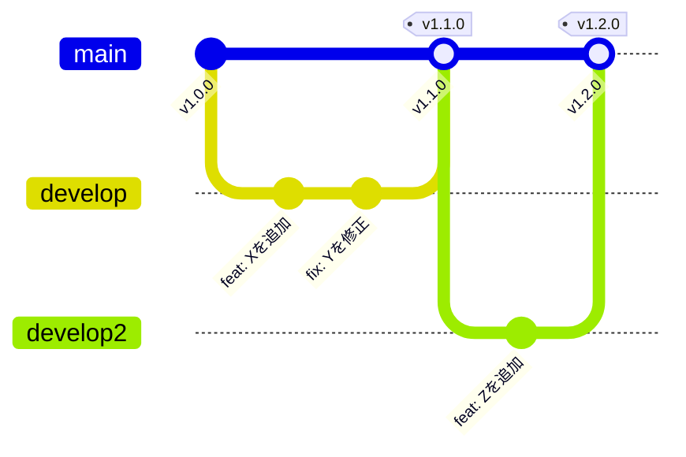

 

# チェンジログ

> [!TIP]
> 新しいバージョンを上に追加してください。`Ctrl+;` で今日の日付を挿入。
> `Ctrl+Shift+P` でスニペットにアクセスし、一貫したフォーマットを維持。

> [!NOTE]
> このチェンジログは [Keep a Changelog](https://keepachangelog.com/) の規約に従っています。日付はすべてISO 8601形式（YYYY-MM-DD）を使用。

---

## リリースブランチモデル

> *全体像 ― 不要なら削除してください。*

## [未リリース]

### 追加

- [新機能や新しい機能]

### 変更

- [既存機能への修正]

## [1.1.0] - 2026-03-15

### 追加

- すべてのページで**ダークモード**をサポート
- ダッシュボードビューからCSVエクスポート
- 認証エンドポイントにレート制限を追加

### 変更

- Node.jsの要件を18から20にアップグレード

### 修正

- ページ境界でページネーションが重複エントリを返す問題
- WebSocket接続ハンドラのメモリリーク

## [1.0.1] - [リリース日]

### 修正

- [バグ修正の説明]
- [バグ修正の説明]

## [1.0.0] - [リリース日]

### 追加

- [初期機能]
- [初期機能]
- [初期機能]

### 変更

- [マイグレーションまたは破壊的変更の説明]

### 削除

- [削除された非推奨機能]

---

*Mark It Downで作成*
