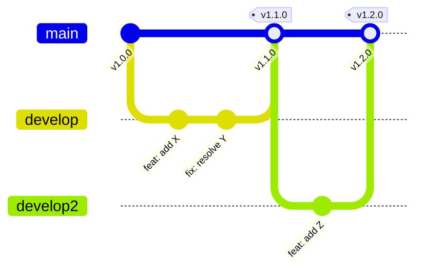

 

# Changelog

> [!TIP]
> Add new versions at the top. Use `Ctrl+;` to insert today's date.
> Use `Ctrl+Shift+P` to access snippets for consistent formatting.

> [!NOTE]
> This changelog follows the [Keep a Changelog](https://keepachangelog.com/) convention. All dates use ISO 8601 format (YYYY-MM-DD).

---

## Release Branching Model

> *Visual overview — delete this section if not needed.*

## [Unreleased]

### Added

- [New feature or capability]

### Changed

- [Modification to existing functionality]

## [1.1.0] - 2026-03-15

### Added

- **Dark mode** support across all pages
- Export to CSV from the dashboard view
- Rate limiting on authentication endpoints

### Changed

- Upgraded Node.js requirement from 18 to 20

### Fixed

- Pagination returning duplicate entries on page boundaries
- Memory leak in WebSocket connection handler

## [1.0.1] - [Release date]

### Fixed

- [Bug fix description]
- [Bug fix description]

## [1.0.0] - [Release date]

### Added

- [Initial feature]
- [Initial feature]
- [Initial feature]

### Changed

- [Migration or breaking change note]

### Removed

- [Deprecated feature that was removed]

---

*Captured with Mark It Down*
