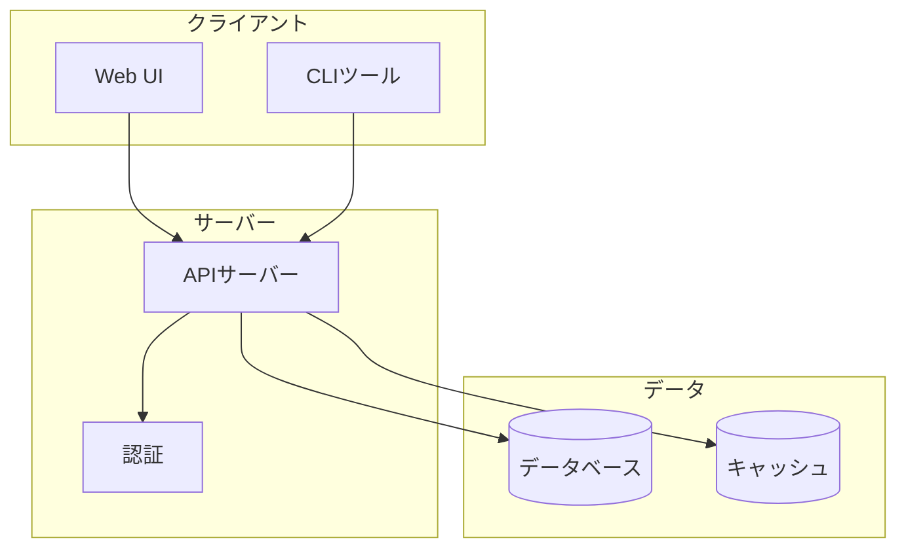

 

# プロジェクトREADME

> [!TIP]
> プロジェクトに合わせて各セクションを記入してください。該当しないセクションは削除しましょう。
> `Ctrl+Shift+P` でスラッシュメニューを開き、コードブロックやスニペットを挿入。

---

## 概要

[このプロジェクトが何をするか、なぜ存在するかを一段落で説明]

## 機能

- [コア機能 1]
- [コア機能 2]
- [コア機能 3]

## クイックスタート

2分以内に動かせます:

```bash
git clone https://github.com/your-org/your-project.git
cd your-project
npm install
npm start
```

起動後、ブラウザで `http://localhost:3000` を開いてください。ダッシュボードが表示されます。

## インストール

### 前提条件

- [ランタイムとバージョン要件]
- [パッケージマネージャの要件]

### セットアップ

```bash
[インストールコマンド]
```

## 使い方

```bash
[基本的な使用コマンドまたはコードスニペット]
```

[コマンドが何をするかの簡単な説明]

## アーキテクチャ

> *全体像 ― 不要なら削除してください。*



## APIリファレンス

| メソッド | エンドポイント | 説明 |
|----------|---------------|------|
| `GET` | [パス] | [説明] |
| `POST` | [パス] | [説明] |
| `PUT` | [パス] | [説明] |
| `DELETE` | [パス] | [説明] |

## コントリビューション

[コントリビューションガイドラインまたはCONTRIBUTING.mdへのリンク]

- [ ] リポジトリをフォーク
- [ ] フィーチャーブランチを作成
- [ ] 新機能のテストを作成
- [ ] プルリクエストを送信

## ライセンス

[ライセンスタイプ] - 詳細は [LICENSE](LICENSE) を参照。

---

*Mark It Downで作成*
