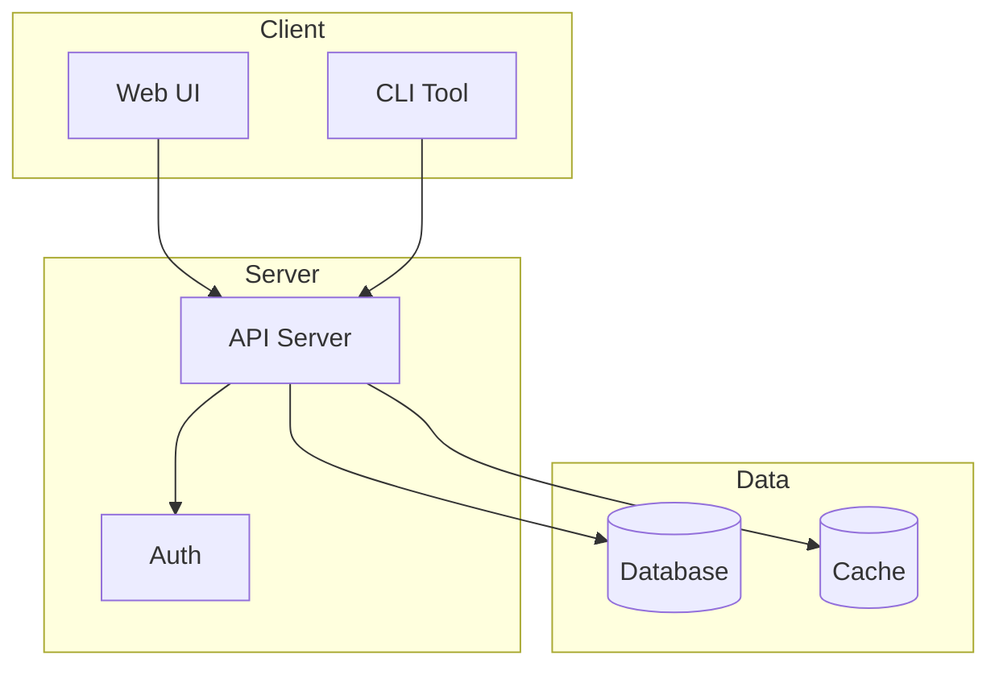

 

# Project README

> [!TIP]
> Fill in each section for your project. Remove any that don't apply.
> Use `Ctrl+Shift+P` to open the slash menu for code blocks and snippets.

---

## Description

[One-paragraph summary of what this project does and why it exists]

## Features

- [Core feature one]
- [Core feature two]
- [Core feature three]

## Quick Start

Get running in under 2 minutes:

```bash
git clone https://github.com/your-org/your-project.git
cd your-project
npm install
npm start
```

After starting, open `http://localhost:3000` in your browser. You should see the dashboard.

## Installation

### Prerequisites

- [Runtime and version requirement]
- [Package manager requirement]

### Setup

```bash
[Installation commands]
```

## Usage

```bash
[Basic usage command or code snippet]
```

[Brief explanation of what the command does]

## Architecture

> *Visual overview — delete this section if not needed.*



## API Reference

| Method | Endpoint | Description |
|--------|----------|-------------|
| `GET` | [Path] | [Description] |
| `POST` | [Path] | [Description] |
| `PUT` | [Path] | [Description] |
| `DELETE` | [Path] | [Description] |

## Contributing

[Contribution guidelines or link to CONTRIBUTING.md]

- [ ] Fork the repository
- [ ] Create a feature branch
- [ ] Write tests for new functionality
- [ ] Submit a pull request

## License

[License type] - see [LICENSE](LICENSE) for details.

---

*Captured with Mark It Down*
