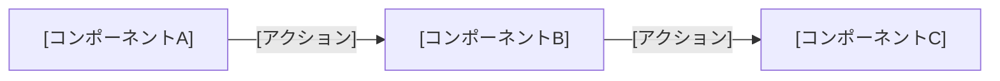
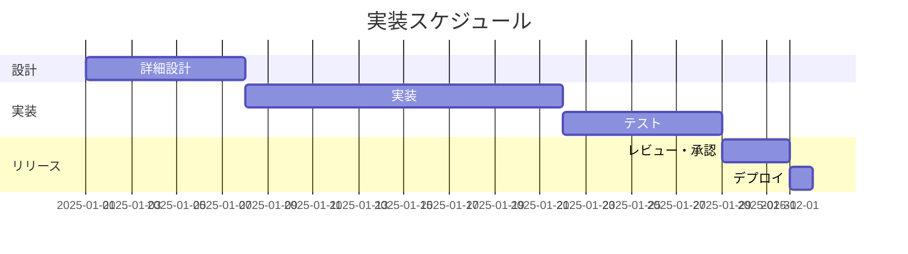

 

# RFC-[番号]: [タイトル]

> [!TIP]
> 1つのRFCに1つの設計提案。`Ctrl+Shift+P` でコードブロックを挿入。
> `Ctrl+;` で日付を挿入。関連するRFCやADRは `Ctrl+K` でリンク。

---

## メタ情報

| 項目 | 内容 |
|------|------|
| **RFC番号** | RFC-[NNN] |
| **著者** | [名前] |
| **作成日** | [YYYY-MM-DD] |
| **ステータス** | [Draft / In Review / Accepted / Rejected / Superseded] |
| **関連RFC** | [RFC-NNN, RFC-NNN] |
| **レビュー期限** | [YYYY-MM-DD] |

## 1. 概要

> [一文で何を提案するかを書く]

## 2. 背景・動機

> 現状の何が問題で、なぜ今これを提案するのか。解決しないと何が起きるか。

[現在の課題、関連する背景、緊急性を記述]

## 3. 提案内容

> 何をどう変えるか。実装・設計の概要。

[設計、実装アプローチ、またはプロセス変更の詳細]

### アーキテクチャ / フロー

> *全体像 ― 不要なら削除してください。*

## 4. 検討した代替案

| 案 | 概要 | 採用しない理由 |
|----|------|--------------|
| 案A（採用） | [提案の要約] | — |
| 案B | [代替アプローチ] | [不採用の理由] |
| 案C | [代替アプローチ] | [不採用の理由] |

## 5. トレードオフ・リスク

| 観点 | メリット | デメリット / リスク |
|------|---------|-------------------|
| パフォーマンス | [期待される改善] | [懸念されるリグレッション] |
| 保守性 | [簡素化] | [追加される複雑さ] |
| 移行コスト | [長期的な利益] | [短期的な労力] |
| セキュリティ | [改善点] | [新たな攻撃面] |

## 6. 実装計画

> *全体像 ― 不要なら削除してください。*

## 7. 未解決の問題

- [ ] [未解決の質問やレビュアーに意見を求めたい点]
- [ ] [別の未解決の質問]

## 8. レビューコメント

| 日付 | レビュア | コメント | ステータス |
|------|---------|---------|-----------|
| [YYYY-MM-DD] | [名前] | [フィードバック] | [Open / Resolved] |

## 9. 決定事項・変更履歴

| 日付 | 変更内容 | 著者 |
|------|---------|------|
| [YYYY-MM-DD] | 初稿作成 | [名前] |

---

*Mark It Downで作成*
