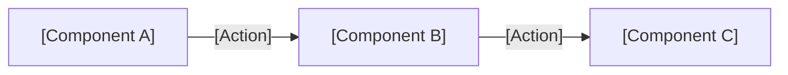
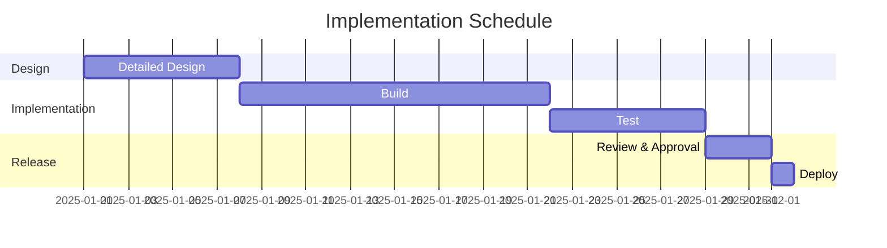

 

# RFC-[Number]: [Title]

> [!TIP]
> One RFC per design proposal. Use `Ctrl+Shift+P` to insert code blocks for technical details.
> Insert dates with `Ctrl+;`. Link related RFCs or ADRs with `Ctrl+K`.

---

## Metadata

| Field | Value |
|-------|-------|
| **RFC Number** | RFC-[NNN] |
| **Author** | [Name] |
| **Created** | [YYYY-MM-DD] |
| **Status** | [Draft / In Review / Accepted / Rejected / Superseded] |
| **Related RFCs** | [RFC-NNN, RFC-NNN] |
| **Review Deadline** | [YYYY-MM-DD] |

## 1. Summary

> [One sentence describing what this RFC proposes]

## 2. Background & Motivation

> Why is this change needed now? What happens if we do nothing?

[Describe the current problem, relevant context, and urgency]

## 3. Proposal

> What are we changing, and how?

[Describe the design, implementation approach, or process change]

### Architecture / Flow

> *Visual overview — delete this section if not needed.*

## 4. Alternatives Considered

| Option | Summary | Why Not Chosen |
|--------|---------|---------------|
| Option A (Proposed) | [Proposal summary] | — |
| Option B | [Alternative approach] | [Reason for rejection] |
| Option C | [Alternative approach] | [Reason for rejection] |

## 5. Trade-offs & Risks

| Aspect | Benefit | Risk / Downside |
|--------|---------|-----------------|
| Performance | [Expected improvement] | [Potential regression] |
| Maintainability | [Simplification] | [Added complexity] |
| Migration cost | [Long-term gain] | [Short-term effort] |
| Security | [Improvement] | [New attack surface] |

## 6. Implementation Plan

> *Visual overview — delete this section if not needed.*

## 7. Open Questions

- [ ] [Unresolved question or area needing input]
- [ ] [Another open question for reviewers]

## 8. Review Comments

| Date | Reviewer | Comment | Status |
|------|----------|---------|--------|
| [YYYY-MM-DD] | [Name] | [Feedback] | [Open / Resolved] |

## 9. Decision & Change Log

| Date | Change | Author |
|------|--------|--------|
| [YYYY-MM-DD] | Initial draft | [Name] |

---

*Captured with Mark It Down*
