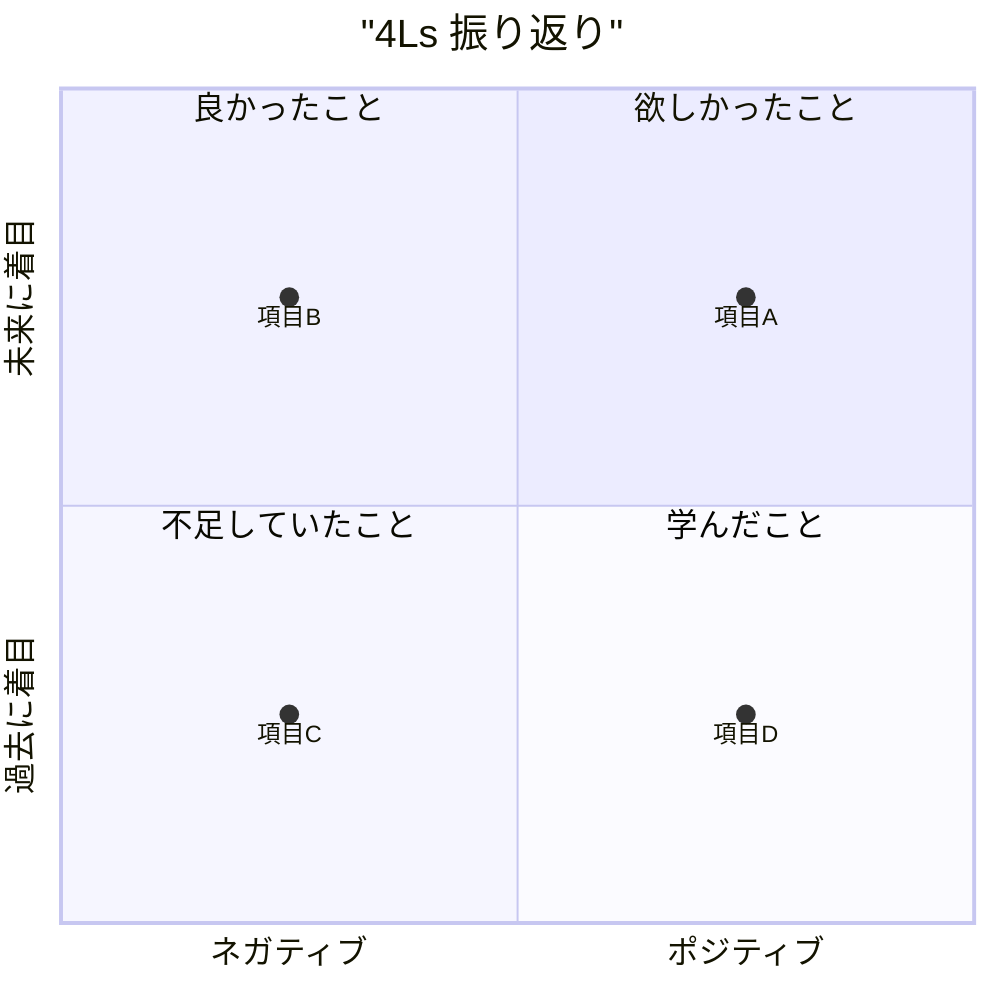

  

# 4Ls 振り返り

> [!TIP]
> スプリントやプロジェクト期間の終わりに実施してください。`Ctrl+;` で今日の日付を挿入。`Ctrl+K` で関連するノート、チケット、意思決定をリンクできます。完了したら `Alt+A` でアーカイブ。

---

| 項目 | 内容 |
|------|------|
| **スプリント / 期間** | [例: Sprint 12 · 2024-01-15 – 2024-01-26] |
| **チーム** | [チーム名または参加者] |
| **ファシリテーター** | [名前] |
| **実施日** | [YYYY-MM-DD] |

## 概要

> *全体像 ― 不要なら削除してください。*
> *Mermaid の quadrantChart で日本語を使う場合はダブルクォートで囲んでください（例: `"ラベル名"`）。*

---

## Liked — 良かったこと

*楽しめたことは何ですか？うまくいって継続すべきことは？*

- [チームが心から楽しんでいた取り組み]
- [うまく機能したプロセス、ツール、またはコラボレーション]
- [成功した瞬間やポジティブなエネルギーがあった場面]

---

## Learned — 学んだこと

*何を学びましたか？新しい気づき、発見、または習得したスキルは？*

- [発見した技術的な洞察やパターン]
- [チーム、プロセス、またはドメインについて学んだこと]
- [検証または否定された前提]

---

## Lacked — 不足していたこと

*何が足りなかったですか？あれば助かったリソース、明確さ、またはサポートは？*

- [欠けていたツール、リソース、またはスキル]
- [もっと明確にできたコミュニケーションや情報]
- [必要だったが得られなかったサポートや余力]

---

## Longed For — 欲しかったこと

*あったら良かったものは何ですか？取り組みたい改善や変化は？*

- [あればよかった機能や仕組み]
- [提案したいプロセス改善]
- [次のスプリントで試してみたいこと]

---

## アクションアイテム

> [!NOTE]
> アクションアイテムは具体的かつ担当者を明確にしましょう。各項目に明確な担当者と期日を設定してください。

- [ ] **[担当者]:** [「不足していたこと」「欲しかったこと」から導いたアクション] — 期日 [YYYY-MM-DD]
- [ ] **[担当者]:** [「不足していたこと」「欲しかったこと」から導いたアクション] — 期日 [YYYY-MM-DD]
- [ ] **[担当者]:** [「不足していたこと」「欲しかったこと」から導いたアクション] — 期日 [YYYY-MM-DD]

## 重要なまとめ

> [この振り返りから得られた最も重要な気づき]

- **継続する:** [続けるべきこと]
- **やめる:** [やめるべきこと]
- **始める:** [次のスプリントで新たに試すこと]

---

*Mark It Downで作成*
