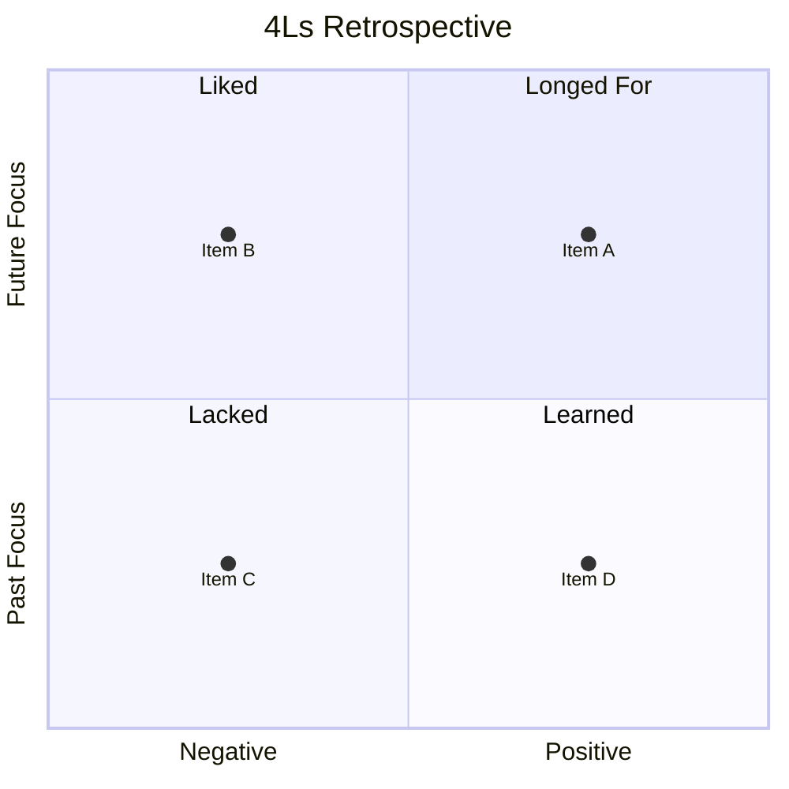

  

# 4Ls Retrospective

> [!TIP]
> Run this at the end of a sprint or project period. Insert today's date with `Ctrl+;`. Use `Ctrl+K` to link related notes, tickets, or decisions. When done, press `Alt+A` to archive.

---

| Field | Details |
|-------|---------|
| **Sprint / Period** | [e.g. Sprint 12 · 2024-01-15 – 2024-01-26] |
| **Team** | [Team name or participants] |
| **Facilitator** | [Name] |
| **Date** | [YYYY-MM-DD] |

## Overview

> *Visual overview — delete this section if not needed.*

---

## Liked

*What did we enjoy? What went well and should be continued?*

- [Something the team genuinely enjoyed doing]
- [A process, tool, or collaboration that worked well]
- [A moment of success or positive energy]

---

## Learned

*What did we learn? New insights, discoveries, or skills gained?*

- [A technical insight or pattern discovered]
- [Something learned about the team, process, or domain]
- [An assumption that was validated or invalidated]

---

## Lacked

*What was missing? Resources, clarity, or support that would have helped?*

- [A tool, resource, or skill that was absent]
- [Communication or information that could have been clearer]
- [Support or capacity that was needed but unavailable]

---

## Longed For

*What did we wish we had? Improvements or changes we want to pursue?*

- [A capability or feature we wished existed]
- [A process improvement we want to propose]
- [Something we want to experiment with next sprint]

---

## Action Items

> [!NOTE]
> Keep action items specific and owned. Each item should have a clear owner and due date.

- [ ] **[Owner]:** [Action derived from Lacked or Longed For] — due [YYYY-MM-DD]
- [ ] **[Owner]:** [Action derived from Lacked or Longed For] — due [YYYY-MM-DD]
- [ ] **[Owner]:** [Action derived from Lacked or Longed For] — due [YYYY-MM-DD]

## Key Takeaways

> [The single most important insight from this retrospective]

- **Keep:** [Something to continue doing]
- **Stop:** [Something to stop doing]
- **Start:** [Something new to try next sprint]

---

*Captured with Mark It Down*
