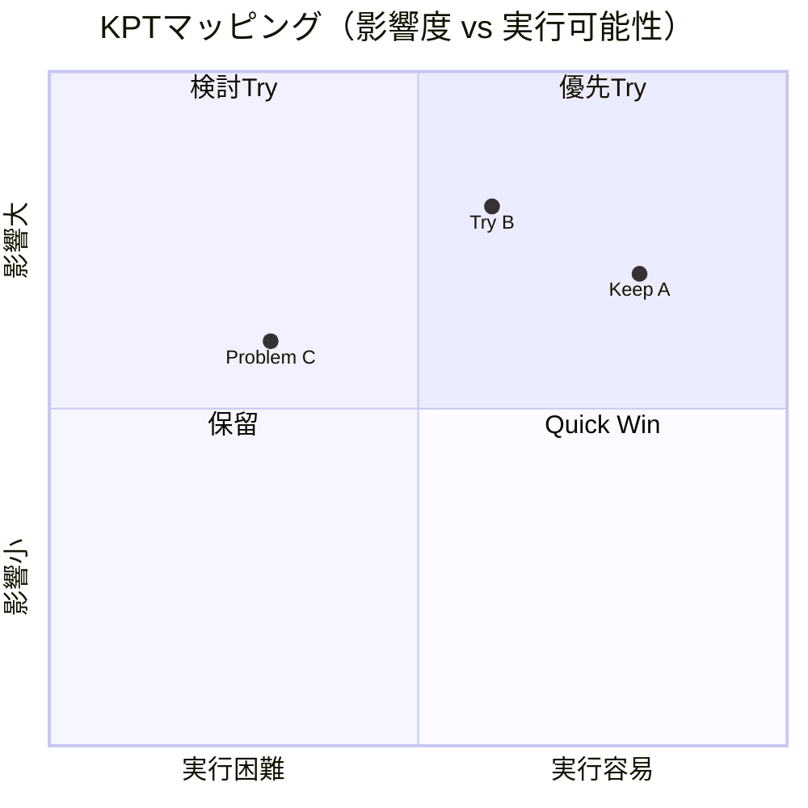

  

# KPT振り返り

> [!TIP]
> `Ctrl+;` で今日の日付を挿入。関連チケットやドキュメントは `Ctrl+K` でリンク。スプリント終了時やフェーズの節目に実施しましょう。完了したら `Alt+A` でアーカイブ。

---

| 項目 | 詳細 |
|------|------|
| **スプリント / 期間** | [スプリントN — YYYY-MM-DD 〜 YYYY-MM-DD] |
| **チーム** | [チーム名または参加者名] |
| **ファシリテーター** | [名前] |
| **参加者** | [名前] |
| **実施日** | [YYYY-MM-DD] |

## KPTボード

> *全体像 ― 不要なら削除してください。*

## Keep（継続すること）

> うまくいっていること。やめたら困ること。

| # | 内容 | 理由・効果 | 提案者 |
|---|------|-----------|--------|
| K1 | [価値を生んだプロセスや取り組み] | [なぜうまくいっているか] | [名前] |
| K2 | [うまく機能したコミュニケーションやチームワーク] | [観察された効果] | [名前] |
| K3 | [繰り返す価値のあるツールやワークフロー] | [得られた利点] | [名前] |

## Problem（問題・課題）

> うまくいっていないこと。障害になっていること。
> 個人への批判ではなく、仕組みや構造の改善に焦点を当てましょう。

| # | 内容 | 影響 | 根本原因（仮説） |
|---|------|------|----------------|
| P1 | [チームのスピードを落としたブロッカーや障害] | [アウトプットへの影響] | [なぜ起きたか] |
| P2 | [プロセスの摩擦や繰り返し発生する非効率] | [時間・品質への影響] | [根本的な理由] |
| P3 | [コミュニケーションのギャップや認識のズレ] | [結果として起きたこと] | [構造的な原因] |

## Try（挑戦・改善策）

> Problemへの対策、または新しい実験。
> 「誰が・何を・いつまでに」を必ず書く。

| # | アクション | 担当 | 期日 | 関連Problem | 完了 |
|---|-----------|------|------|------------|------|
| T1 | [Problemへの具体的な対処] | [名前] | [YYYY-MM-DD] | P1 | ☐ |
| T2 | [1スプリントだけ試すプロセスの調整] | [名前] | [YYYY-MM-DD] | P2 | ☐ |
| T3 | [検証したい新しい取り組みやツール] | [名前] | [YYYY-MM-DD] | P3 | ☐ |

## 前回Tryの振り返り

> 前回のTryは実行できたか？結果を確認しましょう。

| Try | 内容 | 結果 | 次のアクション |
|-----|------|------|--------------|
| T1 | [前回のTry項目] | ✅ Done / ❌ Not Done / 🔄 継続 | [フォローアップが必要な場合] |
| T2 | [前回のTry項目] | ✅ Done / ❌ Not Done / 🔄 継続 | [フォローアップが必要な場合] |

## チームの健康度スコア（任意）

> 5段階で直感的に記入。議論のきっかけとして使う。

| 項目 | スコア（1〜5） | コメント |
|------|-------------|---------|
| チームの心理的安全性 | | |
| コミュニケーション品質 | | |
| 技術的負債への対処 | | |
| デリバリー速度への満足度 | | |

---

*Mark It Downで作成*
