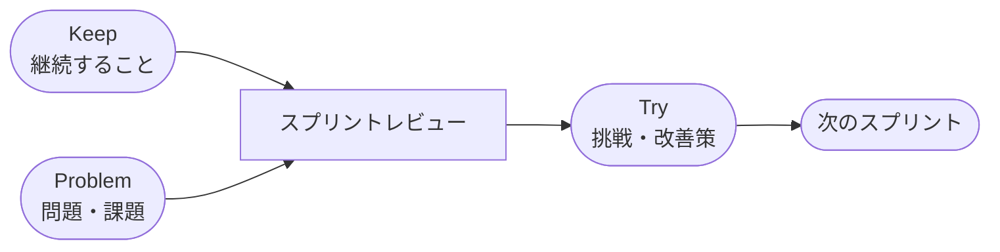

  

# KPT振り返り

> [!TIP]
> `Ctrl+;` で今日の日付を挿入。関連チケットやドキュメントは `Ctrl+K` でリンク。スプリント終了時やフェーズの節目に実施しましょう。

---

| 項目 | 詳細 |
|------|------|
| **スプリント / 期間** | [スプリントN — YYYY-MM-DD 〜 YYYY-MM-DD] |
| **チーム** | [チーム名または参加者名] |
| **ファシリテーター** | [名前] |

## KPTサイクル

> *全体像 ― 不要なら削除してください。*

## Keep（継続すること）

> うまくいったことは何ですか？続けるべき習慣・プロセス・行動を記録しましょう。

- [価値を生んだプロセスや取り組み]
- [うまく機能したコミュニケーションやチームワーク]
- [繰り返す価値のあるツールやワークフロー]

## Problem（問題・課題）

> 何が障害になりましたか？進捗を妨げた問題点や課題を挙げましょう。

- [チームのスピードを落としたブロッカーや障害]
- [プロセスの摩擦や繰り返し発生する非効率]
- [コミュニケーションのギャップや認識のズレ]

> [!NOTE]
> 個人への批判ではなく、仕組みや構造の改善に焦点を当てましょう。

## Try（挑戦・改善策）

> 次のスプリントで試みる改善策は何ですか？

- [ ] [Problemへの具体的な対処 ― 担当者を決める]
- [ ] [1スプリントだけ試すプロセスの調整]
- [ ] [検証したい新しい取り組みやツール]

## アクションアイテム

- [ ] **[担当者]:** [具体的なアクション] — 期限 [YYYY-MM-DD]
- [ ] **[担当者]:** [具体的なアクション] — 期限 [YYYY-MM-DD]
- [ ] **[担当者]:** [具体的なアクション] — 期限 [YYYY-MM-DD]

## 振り返り・メモ

> [複数スプリントにわたって気づいたパターン、今後の参考になる気づき、背景情報など]

---

*Mark It Downで作成*
