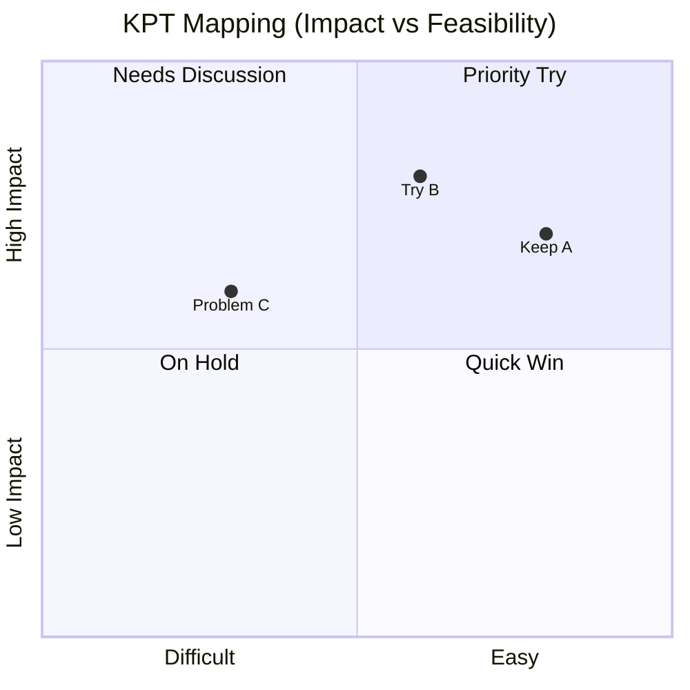

  

# KPT Retrospective

> [!TIP]
> Insert today's date with `Ctrl+;`. Link related tickets or docs with `Ctrl+K`. Run this at the end of each sprint or project phase. When done, press `Alt+A` to archive.

---

| Field | Details |
|-------|---------|
| **Sprint / Period** | [Sprint N — YYYY-MM-DD to YYYY-MM-DD] |
| **Team** | [Team name or participant names] |
| **Facilitator** | [Name] |
| **Participants** | [Names] |
| **Date** | [YYYY-MM-DD] |

## KPT Board

> *Visual overview — delete this section if not needed.*

## Keep — What to Continue

> What went well? What practices, habits, or processes should we continue?

| # | Item | Reason / Effect | Proposed by |
|---|------|-----------------|-------------|
| K1 | [Process or practice that delivered value] | [Why it works] | [Name] |
| K2 | [Communication or collaboration that worked well] | [Impact observed] | [Name] |
| K3 | [Tool or workflow worth repeating] | [Benefit] | [Name] |

## Problem — Issues to Address

> What got in the way? Issues, blockers, and pain points to address.
> Focus on systemic issues, not individual blame.

| # | Item | Impact | Root Cause (Hypothesis) |
|---|------|--------|------------------------|
| P1 | [Blocker or impediment that slowed the team] | [How it affected output] | [Why it happened] |
| P2 | [Process friction or recurring inefficiency] | [Time/quality impact] | [Underlying reason] |
| P3 | [Communication gap or misalignment] | [Consequence] | [Structural cause] |

## Try — Experiments for Next Sprint

> Concrete actions to address Problems or test new approaches.
> Always specify who, what, and by when.

| # | Action | Owner | Due | Related Problem | Done |
|---|--------|-------|-----|-----------------|------|
| T1 | [Specific change to address a Problem] | [Name] | [YYYY-MM-DD] | P1 | ☐ |
| T2 | [Process adjustment to try for one sprint] | [Name] | [YYYY-MM-DD] | P2 | ☐ |
| T3 | [New practice or tool to test] | [Name] | [YYYY-MM-DD] | P3 | ☐ |

## Previous Try Review

> Review last sprint's Try items. Did we follow through?

| Try | Item | Result | Next Action |
|-----|------|--------|-------------|
| T1 | [Last sprint's Try item] | ✅ Done / ❌ Not Done / 🔄 Ongoing | [Follow-up if needed] |
| T2 | [Last sprint's Try item] | ✅ Done / ❌ Not Done / 🔄 Ongoing | [Follow-up if needed] |

## Team Health Score (Optional)

> Rate 1–5 intuitively. Use as a conversation starter, not a metric.

| Dimension | Score (1–5) | Comment |
|-----------|-------------|---------|
| Psychological safety | | |
| Communication quality | | |
| Technical debt management | | |
| Delivery pace satisfaction | | |

---

*Captured with Mark It Down*
