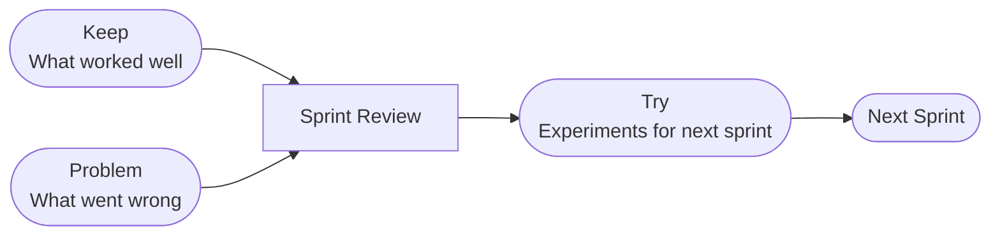

  

# KPT Retrospective

> [!TIP]
> Insert today's date with `Ctrl+;`. Link related tickets or docs with `Ctrl+K`. Run this at the end of each sprint or project phase. When done, press `Alt+A` to archive.

---

| Field | Details |
|-------|---------|
| **Sprint / Period** | [Sprint N — YYYY-MM-DD to YYYY-MM-DD] |
| **Team** | [Team name or participant names] |
| **Facilitator** | [Name] |

## KPT Cycle

> *Visual overview — delete this section if not needed.*

## Keep

> What went well? What practices, habits, or processes should we continue?

- [Process or practice that delivered value]
- [Communication or collaboration that worked well]
- [Tool or workflow worth repeating]

## Problem

> What got in the way? Issues, blockers, and pain points to address.

- [Blocker or impediment that slowed the team]
- [Process friction or recurring inefficiency]
- [Communication gap or misalignment]

> [!NOTE]
> Focus on systemic issues, not individual blame. The goal is to improve the process.

## Try

> What experiments or improvements will we commit to next sprint?

- [ ] [Concrete change to address a Problem — assign an owner]
- [ ] [Process adjustment to try for one sprint]
- [ ] [New practice or tool to test]

## Action Items

- [ ] **[Owner]:** [Specific action] — due [YYYY-MM-DD]
- [ ] **[Owner]:** [Specific action] — due [YYYY-MM-DD]
- [ ] **[Owner]:** [Specific action] — due [YYYY-MM-DD]

## Reflection / Notes

> [Open observations, patterns noticed across multiple sprints, or context for future reference]

---

*Captured with Mark It Down*
