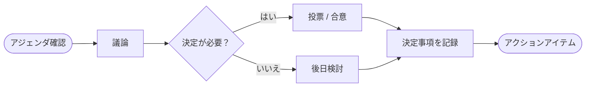

  

# ミーティングノート

> [!TIP]
> `Ctrl+Shift+;` で会議の日時を挿入。会議中は `Ctrl+Alt+;` で各議題にタイムスタンプ見出しを追加。

---

| 項目 | 詳細 |
|------|------|
| **日付** | [YYYY-MM-DD] |
| **時間** | [HH:MM - HH:MM] |
| **参加者** | [名前, 名前, 名前] |
| **場所** | [会議室名またはビデオリンク] |

## 会議フロー

> *全体像 ― 不要なら削除してください。*

## アジェンダ

1. [最初の議題]
2. [2番目の議題]
3. [3番目の議題]

## 議論メモ

### [最初の議題]

[この議論の要点、議論の内容、文脈]

### [2番目の議題]

[この議論の要点]

### [3番目の議題]

[この議論の要点]

## 決定事項

- **[決定トピック]:** [何が決定されたか、その理由]
- **[決定トピック]:** [何が決定されたか、なぜか]

> [!NOTE]
> 結果だけでなく、各決定の理由も記録しましょう。未来の自分が現在の自分に感謝します。

## アクションアイテム

- [ ] **[担当者]:** [タスク内容] — 期限 [YYYY-MM-DD]
- [ ] **[担当者]:** [タスク内容] — 期限 [YYYY-MM-DD]
- [ ] **[担当者]:** [タスク内容] — 期限 [YYYY-MM-DD]

---

*Mark It Downで作成*
