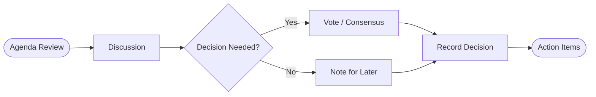

  

# Meeting Notes

> [!TIP]
> Insert meeting datetime with `Ctrl+Shift+;`. During the meeting, press `Ctrl+Alt+;` to add timestamp headings for each discussion point. Search past meeting notes with `Ctrl+K`.

---

| Field | Details |
|-------|---------|
| **Date** | [YYYY-MM-DD] |
| **Time** | [HH:MM - HH:MM] |
| **Attendees** | [Name, Name, Name] |
| **Location** | [Room name or video link] |

## Meeting Flow

> *Visual overview — delete this section if not needed.*

## Agenda

1. [First agenda item]
2. [Second agenda item]
3. [Third agenda item]

## Discussion Notes

### [First agenda item]

[Key points, arguments, and context from this discussion]

### [Second agenda item]

[Key points from this discussion]

### [Third agenda item]

[Key points from this discussion]

## Decisions Made

- **[Decision topic]:** [What was decided and the rationale]
- **[Decision topic]:** [What was decided and why]

> [!NOTE]
> Record the reasoning behind each decision, not just the outcome. Future you will thank present you.

## Action Items

- [ ] **[Owner]:** [Task description] — due [YYYY-MM-DD]
- [ ] **[Owner]:** [Task description] — due [YYYY-MM-DD]
- [ ] **[Owner]:** [Task description] — due [YYYY-MM-DD]

---

*Captured with Mark It Down*
