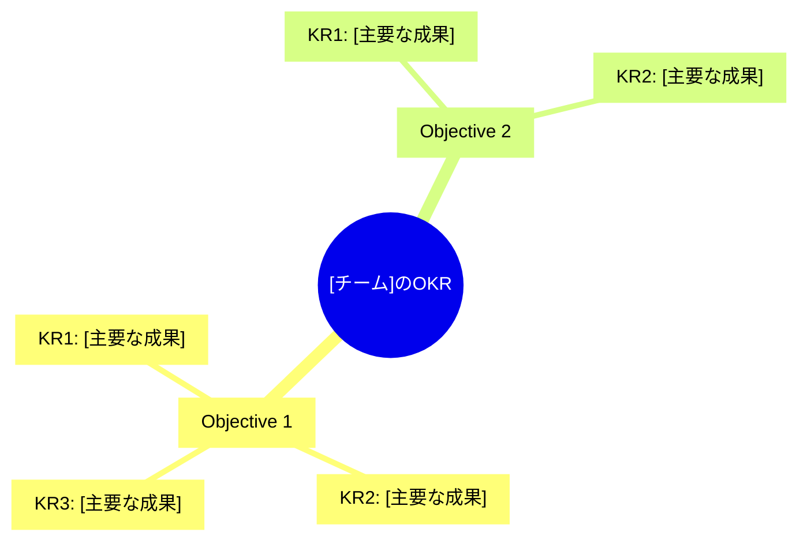

 

# OKR — 目標と主要な成果

> [!TIP]
> `Ctrl+;` で今日の日付を挿入。関連する目標やダッシュボードは `Ctrl+K` でリンク。
> 週次で進捗を更新。Key Resultはタスクではなく、測定可能なアウトカムで記述。

---

## メタ情報

| 項目 | 内容 |
|------|------|
| **対象期間** | [YYYY-QN（MM/DD 〜 MM/DD）] |
| **組織 / 個人** | [チーム名または個人名] |
| **作成日** | [YYYY-MM-DD] |
| **レビュー日** | 中間: [YYYY-MM-DD] / 最終: [YYYY-MM-DD] |

## OKR全体像

> *全体像 ― 不要なら削除してください。*

## Objective 1

### [鼓舞される目標ステートメント]

> なぜこのObjectiveが重要か: [背景・意図]

| # | Key Result | 単位 | 開始値 | 目標値 | 現在値 | 進捗 |
|---|-----------|------|--------|--------|--------|------|
| KR1 | [測定可能なアウトカム] | [単位] | [開始値] | [目標値] | [現在値] | [0–100]% |
| KR2 | [測定可能なアウトカム] | [単位] | [開始値] | [目標値] | [現在値] | [0–100]% |
| KR3 | [測定可能なアウトカム] | [単位] | [開始値] | [目標値] | [現在値] | [0–100]% |

**Objective達成スコア（中間）:** [スコア] / 1.0

> [!NOTE]
> 0.6〜0.7が「野心的な目標の適切な達成」とされる。

## Objective 2

### [鼓舞される目標ステートメント]

> なぜこのObjectiveが重要か: [背景・意図]

| # | Key Result | 単位 | 開始値 | 目標値 | 現在値 | 進捗 |
|---|-----------|------|--------|--------|--------|------|
| KR1 | [測定可能なアウトカム] | [単位] | [開始値] | [目標値] | [現在値] | [0–100]% |
| KR2 | [測定可能なアウトカム] | [単位] | [開始値] | [目標値] | [現在値] | [0–100]% |

**Objective達成スコア（中間）:** [スコア] / 1.0

## 週次チェックインログ

| 週 | 日付 | 進捗ハイライト | ブロッカー | 翌週のフォーカス |
|----|------|-------------|-----------|---------------|
| W1 | [YYYY-MM-DD] | | | |
| W2 | [YYYY-MM-DD] | | | |
| W3 | [YYYY-MM-DD] | | | |

## 振り返り（四半期末）

**達成できたこと:**

> [成果とアコンプリッシュメント]

**達成できなかったこと・学び:**

> [学びと改善の余地]

**次Qへの引き継ぎ:**

> [継続する項目や目標]

---

*Mark It Downで作成*
