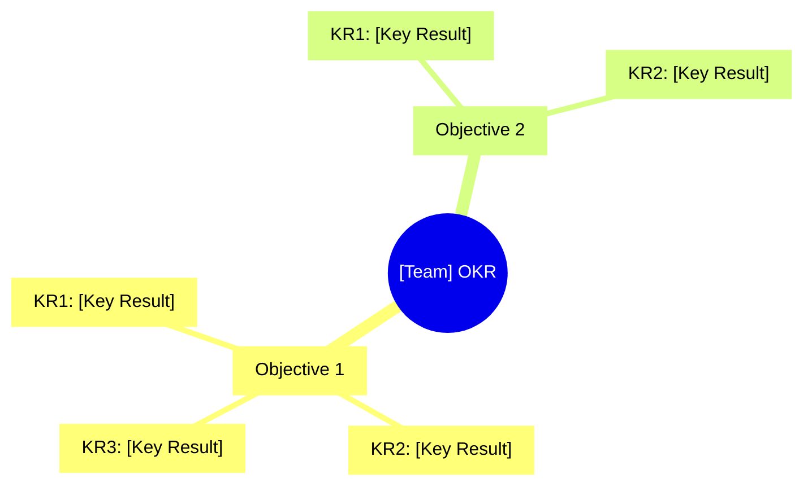

 

# OKR — Objectives and Key Results

> [!TIP]
> Insert today's date with `Ctrl+;`. Use `Ctrl+K` to link related goals or dashboards.
> Update progress weekly — keep Key Results measurable and outcome-focused, not task-based.

---

## Metadata

| Field | Value |
|-------|-------|
| **Period** | [YYYY-QN (MM/DD – MM/DD)] |
| **Org / Individual** | [Team or person name] |
| **Created** | [YYYY-MM-DD] |
| **Review dates** | Mid: [YYYY-MM-DD] / Final: [YYYY-MM-DD] |

## OKR Overview

> *Visual overview — delete this section if not needed.*

## Objective 1

### [Inspiring objective statement]

> Why this Objective matters: [Background and intent]

| # | Key Result | Unit | Start | Target | Current | Progress |
|---|-----------|------|-------|--------|---------|----------|
| KR1 | [Measurable outcome] | [Unit] | [Start value] | [Target value] | [Current value] | [0–100]% |
| KR2 | [Measurable outcome] | [Unit] | [Start value] | [Target value] | [Current value] | [0–100]% |
| KR3 | [Measurable outcome] | [Unit] | [Start value] | [Target value] | [Current value] | [0–100]% |

**Objective Score (Mid-Quarter):** [Score] / 1.0

> [!NOTE]
> 0.6–0.7 is considered healthy achievement for ambitious goals.

## Objective 2

### [Inspiring objective statement]

> Why this Objective matters: [Background and intent]

| # | Key Result | Unit | Start | Target | Current | Progress |
|---|-----------|------|-------|--------|---------|----------|
| KR1 | [Measurable outcome] | [Unit] | [Start value] | [Target value] | [Current value] | [0–100]% |
| KR2 | [Measurable outcome] | [Unit] | [Start value] | [Target value] | [Current value] | [0–100]% |

**Objective Score (Mid-Quarter):** [Score] / 1.0

## Weekly Check-in Log

| Week | Date | Progress Highlights | Blockers | Next Week's Focus |
|------|------|-------------------|----------|-------------------|
| W1 | [YYYY-MM-DD] | | | |
| W2 | [YYYY-MM-DD] | | | |
| W3 | [YYYY-MM-DD] | | | |

## End-of-Quarter Reflection

**What we achieved:**

> [Wins and accomplishments]

**What we didn't achieve — and what we learned:**

> [Learnings and areas for improvement]

**Carry over to next quarter:**

> [Items or goals to continue]

---

*Captured with Mark It Down*
