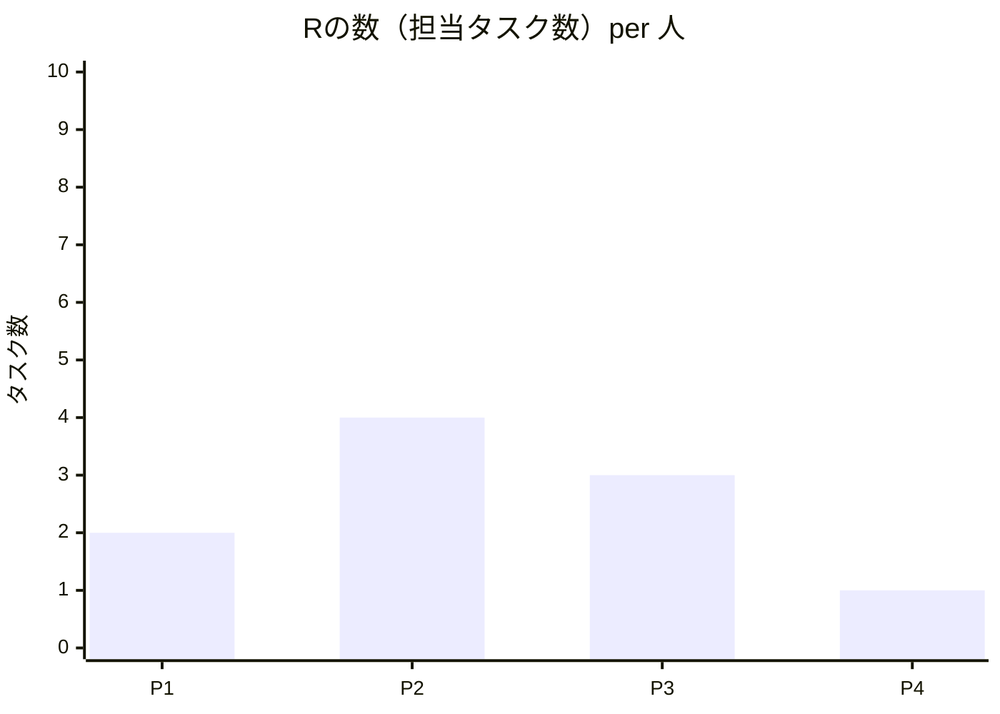

 

# RACIマトリクス

> [!TIP]
> `Ctrl+;` で日付を挿入。関連プロジェクト文書は `Ctrl+K` でリンク。
> R=実行責任者 / A=説明責任者（タスクごとに1人） / C=相談される人 / I=報告を受ける人。

---

## メタ情報

| 項目 | 内容 |
|------|------|
| **プロジェクト / プロセス名** | [プロジェクト名] |
| **作成日** | [YYYY-MM-DD] |
| **作成者** | [名前] |
| **バージョン** | Rev. [N] |

## ステークホルダー一覧

| ID | 氏名 / 役割 | 部門 | 備考 |
|----|-----------|------|------|
| P1 | [氏名 — 役割] | [部門] | |
| P2 | [氏名 — 役割] | [部門] | |
| P3 | [氏名 — 役割] | [部門] | |
| P4 | [氏名 — 役割] | [部門] | |

## RACIマトリクス本体

| # | タスク / 成果物 | P1 | P2 | P3 | P4 | 備考 |
|---|--------------|----|----|----|----|------|
| 1 | [タスクまたは成果物] | A | R | C | I | |
| 2 | [タスクまたは成果物] | | A/R | | I | |
| 3 | [タスクまたは成果物] | C | R | A | I | |
| 4 | [タスクまたは成果物] | I | C | R | A | |
| 5 | [タスクまたは成果物] | | R | C | A | |

## 責任集中チェック

> *全体像 ― 不要なら削除してください。*

> [!WARNING]
> 1人にRが集中している場合はボトルネックリスク。再分配を検討。

## よくある問題チェックリスト

- [ ] すべてのタスクにAが1人だけ設定されているか
- [ ] RとAが同一人物のタスクが多すぎないか（負荷集中）
- [ ] Cが多すぎて意思決定が遅くなっていないか
- [ ] Iが少なすぎて情報伝達漏れが起きていないか

---

*Mark It Downで作成*
