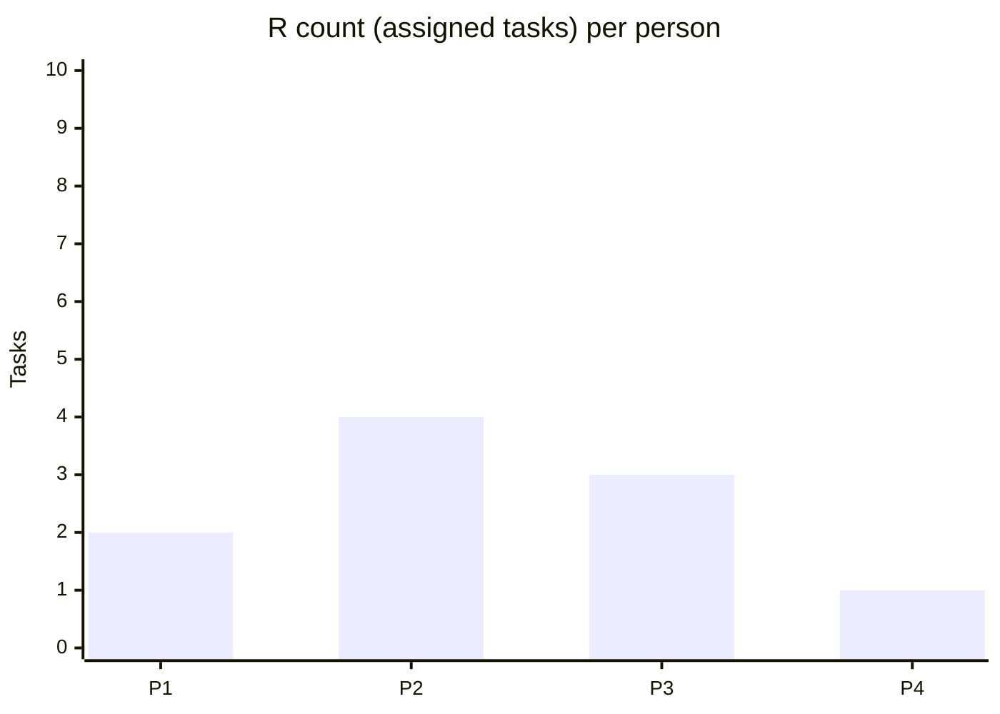

 

# RACI Matrix

> [!TIP]
> Use `Ctrl+;` to insert the date. Link related project docs with `Ctrl+K`.
> R = Responsible (does the work) / A = Accountable (approves, one per task) / C = Consulted / I = Informed.

---

## Metadata

| Field | Value |
|-------|-------|
| **Project / Process** | [Project name] |
| **Created** | [YYYY-MM-DD] |
| **Author** | [Name] |
| **Version** | Rev. [N] |

## Stakeholders

| ID | Name / Role | Department | Notes |
|----|-------------|-----------|-------|
| P1 | [Name — Role] | [Department] | |
| P2 | [Name — Role] | [Department] | |
| P3 | [Name — Role] | [Department] | |
| P4 | [Name — Role] | [Department] | |

## RACI Matrix

| # | Task / Deliverable | P1 | P2 | P3 | P4 | Notes |
|---|-------------------|----|----|----|----|-------|
| 1 | [Task or deliverable] | A | R | C | I | |
| 2 | [Task or deliverable] | | A/R | | I | |
| 3 | [Task or deliverable] | C | R | A | I | |
| 4 | [Task or deliverable] | I | C | R | A | |
| 5 | [Task or deliverable] | | R | C | A | |

## Responsibility Distribution Check

> *Visual overview — delete this section if not needed.*

> [!WARNING]
> If R is concentrated on one person, there is a bottleneck risk. Consider redistributing.

## Common Issues Checklist

- [ ] Every task has exactly one A (Accountable)
- [ ] R and A are not the same person too often (overload risk)
- [ ] Not too many C entries slowing decisions
- [ ] Enough I entries to prevent information gaps

---

*Captured with Mark It Down*
