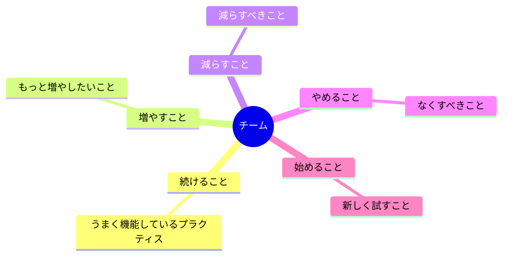

  

# スターフィッシュ振り返り

> [!TIP]
> スプリントやフェーズの終わりに実施してください。`Ctrl+;` で今日の日付を挿入。`Ctrl+K` でアクションアイテムをチケットやドキュメントにリンク。完了したら `Alt+A` でアーカイブ。

---

| 項目 | 詳細 |
|------|------|
| **スプリント / 期間** | [例: スプリント12 · 2024-01-15 → 2024-01-26] |
| **チーム** | [チーム名または参加者] |
| **ファシリテーター** | [名前] |
| **日付** | [YYYY-MM-DD] |

## 全体像

> *全体像 ― 不要なら削除してください。*

---

## 続けること（Keep Doing）

> チームがうまくできていること。守り続ける価値のある習慣やプラクティス。

- [継続的に価値を生み出していることは？]
- [スムーズで効率的なプロセスは？]
- [チームを強くしている行動は？]

---

## 増やすこと（More Of）

> 良いことではあるが、まだ十分ではないこと。頻度や投資を増やす。

- [効果はあるが活用しきれていないことは？]
- [もっと定期的にできる良い習慣は？]
- [頻度を増やせばより大きな効果が出ることは？]

---

## 減らすこと（Less Of）

> 存在する理由はあるが、摩擦を生んでいること。なくすのではなく、減らす。

- [価値に対して時間がかかりすぎていることは？]
- [短くまたは軽くできる会議やプロセスは？]
- [見合った恩恵なくチームの速度を落としているものは？]

---

## やめること（Stop Doing）

> 価値を生まず、完全にやめるべきこと。

- [積極的に害になっている、または無駄なことは？]
- [チームがすぐにやめるべき習慣やプロセスは？]
- [意図ではなく惰性でやっていることは？]

---

## 始めること（Start Doing）

> チームがまだ試していない新しいアイデアや実験、プラクティス。

- [チームが後回しにしていて、助けになりそうなことは？]
- [試してみる価値のあるツール・テクニック・儀式は？]
- [他のチームが成功させていて取り入れられそうなことは？]

---

## 優先アクション

> [!NOTE]
> このリストは短く保ちましょう。最初はやめることと始めることから1〜2項目ずつ選ぶだけで十分です。

- [ ] **[担当者]:** [やめること / 始めること / 増やすことのアクション] — 期限 [YYYY-MM-DD]
- [ ] **[担当者]:** [アクションアイテム] — 期限 [YYYY-MM-DD]
- [ ] **[担当者]:** [アクションアイテム] — 期限 [YYYY-MM-DD]

## チームディスカッションメモ

[振り返りの中で出てきたテーマ・緊張感・アイデアで、どのカテゴリにも収まらなかったものを自由に記録してください]

---

*Mark It Downで作成*
