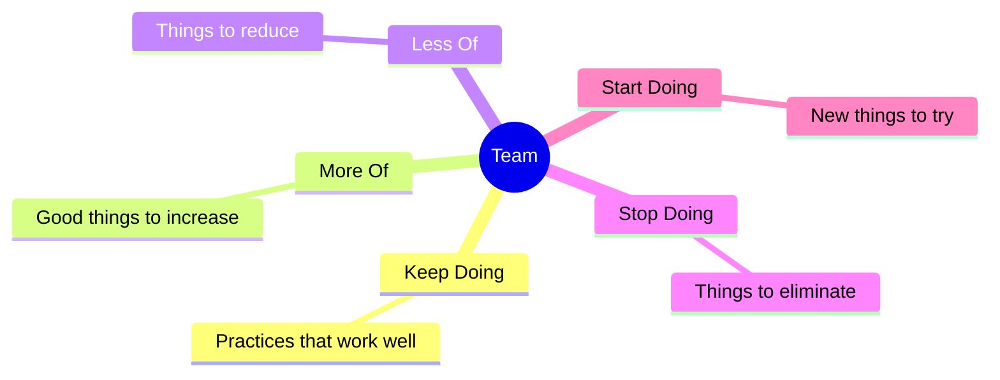

  

# Starfish Retrospective

> [!TIP]
> Run this at the end of a sprint or project phase. Insert today's date with `Ctrl+;`. Use `Ctrl+K` to link related action items to tickets or docs. When done, press `Alt+A` to archive.

---

| Field | Details |
|-------|---------|
| **Sprint / Period** | [e.g., Sprint 12 · 2024-01-15 → 2024-01-26] |
| **Team** | [Team name or participants] |
| **Facilitator** | [Name] |
| **Date** | [YYYY-MM-DD] |

## Overview

> *Visual overview — delete this section if not needed.*

---

## Keep Doing

> Things the team does well and should continue. These are working practices worth protecting.

- [What is consistently delivering value?]
- [Which processes are smooth and efficient?]
- [What behaviours strengthen the team?]

---

## More Of

> Things that are good but not happening enough. Increase frequency or investment.

- [What is working but under-utilised?]
- [Which good habits could become more regular?]
- [What would have a bigger impact if done more often?]

---

## Less Of

> Things that exist for a reason but are creating friction. Reduce, not eliminate.

- [What is taking too much time relative to its value?]
- [Which meetings or processes could be shorter or lighter?]
- [What slows the team down without a proportional benefit?]

---

## Stop Doing

> Things that are not adding value and should be eliminated entirely.

- [What is actively harmful or wasteful?]
- [Which habits or processes should the team drop immediately?]
- [What is the team doing out of inertia rather than intent?]

---

## Start Doing

> New ideas, experiments, or practices the team has not tried yet.

- [What has the team been putting off that could help?]
- [Which tools, techniques, or rituals are worth experimenting with?]
- [What have other teams done successfully that this team could adopt?]

---

## Priority Actions

> [!NOTE]
> Keep this list short. Pick the highest-impact items — one or two from Stop and Start is enough to begin with.

- [ ] **[Owner]:** [Action from Stop / Start / More Of] — due [YYYY-MM-DD]
- [ ] **[Owner]:** [Action item] — due [YYYY-MM-DD]
- [ ] **[Owner]:** [Action item] — due [YYYY-MM-DD]

## Team Discussion Notes

[Open space for themes, tensions, or ideas that came up during the retrospective but did not fit neatly into a category]

---

*Captured with Mark It Down*
