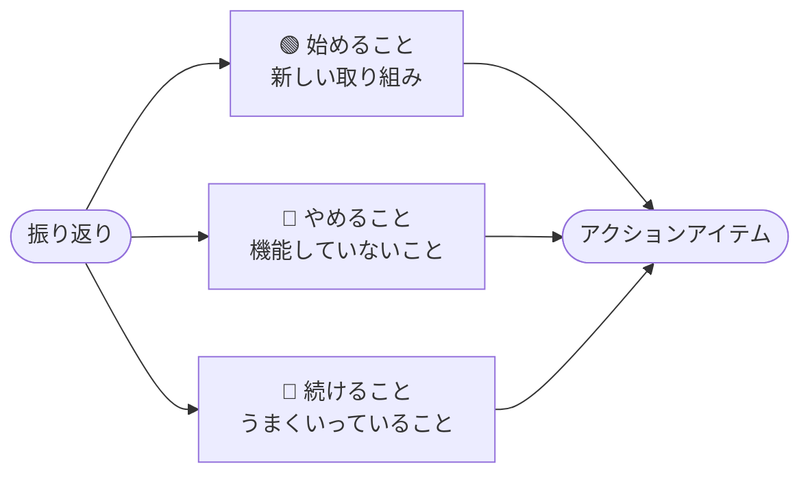

  

# スタート・ストップ・コンティニュー 振り返り

> [!TIP]
> スプリントや期間の終わりに記入しましょう。`Ctrl+;` で今日の日付を挿入。関連ノートやアクションアイテムのリンクは `Ctrl+K` で追加。完了したら `Alt+A` でアーカイブ。

---

## スプリント・期間情報

| 項目 | 詳細 |
|------|------|
| **スプリント・期間** | [スプリント42 / Q2 第3週] |
| **日付** | [YYYY-MM-DD] |
| **ファシリテーター** | [名前] |
| **チーム** | [チームまたはプロジェクト名] |

## 概要

> *全体像 ― 不要なら削除してください。*

---

## 🟢 始めること

*新しく取り入れるべき実践、実験、または改善。*

- [導入すべき新しい取り組み]
- [試してみる価値のある実験]
- [試験的に導入するプロセス改善]
- [採用すべきツールや手法]

> [!NOTE]
> 実行可能な変更に絞りましょう。次のスプリントで現実的に始められる内容にしてください。

---

## 🔴 やめること

*機能していないこと、無駄、または摩擦を生んでいること。*

- [価値を生んでいない活動]
- [不要なオーバーヘッドを生むプロセス]
- [チームの速度を下げる習慣]
- [繰り返し発生するフラストレーションの原因]

> [!NOTE]
> 具体的かつ個人を対象にしないようにしましょう。個人ではなく、行動やプロセスに焦点を当ててください。

---

## 🔵 続けること

*うまくいっていること、維持すべきこと。*

- [残すべき取り組み]
- [チームの士気や成果を高める習慣]
- [円滑に機能しているプロセス]
- [強化すべきコラボレーションのパターン]

---

## アクションアイテム

- [ ] **[担当者]:** [「始めること」からの具体的なアクション] — 期限：[YYYY-MM-DD]
- [ ] **[担当者]:** [「やめること」からの具体的なアクション] — 期限：[YYYY-MM-DD]
- [ ] **[担当者]:** [「続けること」からの具体的なアクション] — 期限：[YYYY-MM-DD]

---

## チームの合意

> *この振り返りの結果として、チームが交わしたコミットメントを記録してください。*

- [次のスプリントに向けた合意事項・規範]
- [次のスプリントに向けた合意事項・規範]

---

*Mark It Downで作成*
