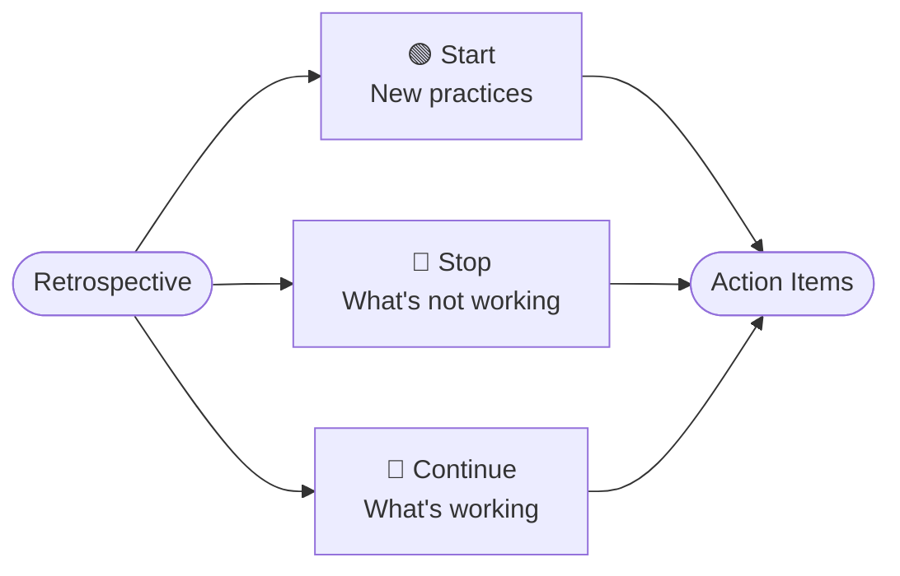

  

# Start-Stop-Continue Retrospective

> [!TIP]
> Run this at the end of a sprint or period. Insert today's date with `Ctrl+;`. Use `Ctrl+K` to link related notes or action items.

---

## Sprint / Period Info

| Field | Details |
|-------|---------|
| **Sprint / Period** | [Sprint 42 / Q2 Week 3] |
| **Date** | [YYYY-MM-DD] |
| **Facilitator** | [Name] |
| **Team** | [Team or project name] |

## Overview

> *Visual overview — delete this section if not needed.*

---

## 🟢 Start

*Things we should begin doing — new practices, experiments, or improvements.*

- [New practice to introduce]
- [Experiment worth trying]
- [Process improvement to pilot]
- [Tool or technique to adopt]

> [!NOTE]
> Focus on actionable changes. Each item should be something the team can realistically begin in the next sprint.

---

## 🔴 Stop

*Things we should stop doing — what's not working, waste, or causing friction.*

- [Activity that isn't adding value]
- [Process that creates unnecessary overhead]
- [Habit that slows the team down]
- [Source of recurring frustration]

> [!NOTE]
> Be specific and non-personal. Focus on behaviors and processes, not individuals.

---

## 🔵 Continue

*Things that are working well and should be kept.*

- [Practice worth preserving]
- [Habit that boosts team morale or output]
- [Process that's running smoothly]
- [Collaboration pattern to reinforce]

---

## Action Items

- [ ] **[Owner]:** [Specific action from Start] — due [YYYY-MM-DD]
- [ ] **[Owner]:** [Specific action from Stop] — due [YYYY-MM-DD]
- [ ] **[Owner]:** [Specific action from Continue] — due [YYYY-MM-DD]

---

## Team Agreement

> *Capture any commitments the team makes as a result of this retrospective.*

- [Agreed change or norm for the next sprint]
- [Agreed change or norm for the next sprint]

---

*Captured with Mark It Down*
