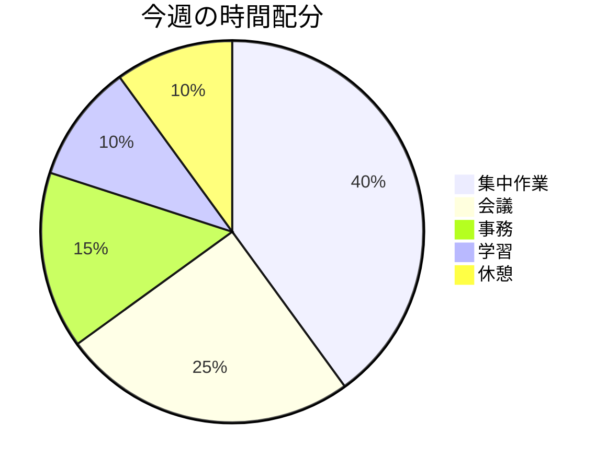

  

# ウィークリーレビュー

> [!TIP]
> 毎週末に記入してください。`Ctrl+;` で週の日付範囲を挿入。過去のレビューは `Ctrl+K` で検索。完了したら `Alt+A` でアーカイブ。

---

## 今週の概要

> *全体像 ― 不要なら削除してください。*

## 成果

- [達成したこと・完了した目標]
- [予想以上にうまくいったこと]
- [記録に値する小さな勝利]

## 課題

- [進捗を妨げたものは？]
- [予想以上に時間がかかったことは？]
- [エネルギーを消耗したことは？]

## 学んだこと

> [今週の重要な気づき。来週以降も活かしたいこと]

- [次はどうやって違うやり方をする？]
- [来週も繰り返すことは？]

## 来週の優先事項

- [ ] **優先事項 1:** [来週最も重要な目標]
- [ ] **優先事項 2:** [2番目に重要な目標]
- [ ] **優先事項 3:** [3番目の優先事項]
- [ ] [追加タスク]
- [ ] [追加タスク]

> [!NOTE]
> 優先事項は3〜5項目に絞りましょう。すべてが優先だと、何も優先ではなくなります。

## 習慣トラッカー

| 習慣 | 月 | 火 | 水 | 木 | 金 | 土 | 日 |
|------|-----|-----|-----|-----|-----|-----|-----|
| [運動] | | | | | | | |
| [読書] | | | | | | | |
| [瞑想] | | | | | | | |
| [ライティング] | | | | | | | |

> [!TIP]
> 完了は `x`、スキップは `-`、該当なしは空欄にしましょう。

---

*Mark It Downで作成*
