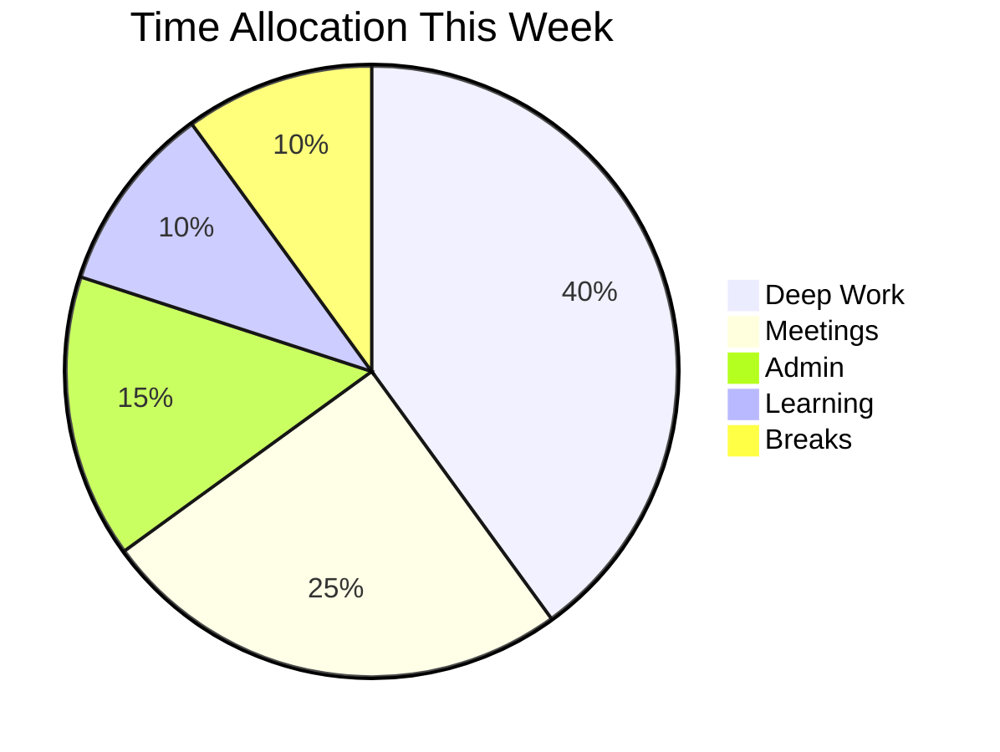

  

# Weekly Review

> [!TIP]
> Complete this at the end of each week. Insert the week's date range with `Ctrl+;`. When done, press `Alt+A` to archive completed weeks.

---

## Week at a Glance

> *Visual overview — delete this section if not needed.*

## Wins

- [Achievement or completed goal]
- [Something that went better than expected]
- [A small victory worth noting]

## Challenges

- [What blocked your progress?]
- [What took longer than expected?]
- [What drained your energy?]

## Lessons Learned

> [Key insight from this week that you want to carry forward]

- [What would you do differently?]
- [What will you repeat next week?]

## Next Week's Priorities

- [ ] **Priority 1:** [Most important goal for next week]
- [ ] **Priority 2:** [Second most important goal]
- [ ] **Priority 3:** [Third priority]
- [ ] [Additional task]
- [ ] [Additional task]

> [!NOTE]
> Limit priorities to 3-5 items. If everything is a priority, nothing is.

## Habit Tracker

| Habit | Mon | Tue | Wed | Thu | Fri | Sat | Sun |
|-------|-----|-----|-----|-----|-----|-----|-----|
| [Exercise] | | | | | | | |
| [Reading] | | | | | | | |
| [Meditation] | | | | | | | |
| [Writing] | | | | | | | |

> [!TIP]
> Use `x` for done, `-` for skipped, leave blank for N/A.

---

*Captured with Mark It Down*
