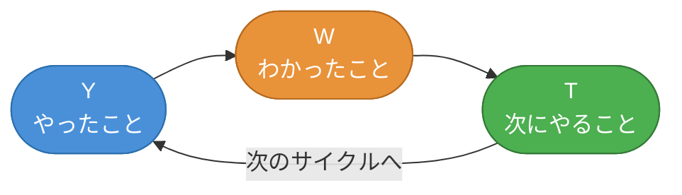

  

# YWT振り返り

> [!TIP]
> スプリントや期間の終わりに記入してください。`Ctrl+;` で今日の日付を挿入。`Ctrl+K` でリンクを追加してリソースや参考資料を紐づけ。

---

## 期間・スプリント情報

| 項目 | 詳細 |
|------|------|
| **期間** | [YYYY-MM-DD] 〜 [YYYY-MM-DD] |
| **スプリント / 回** | [第〇回 / Sprint #〇] |
| **参加者** | [名前, 名前, 名前] |
| **ファシリテーター** | [名前] |

## YWTサイクル

> *全体像 ― 不要なら削除してください。*

---

## Y — やったこと

> 事実として起きたこと・実施したことを列挙します。評価や感想は含めず、客観的な行動・出来事を記録しましょう。

- [実施したタスクや活動]
- [完了した機能・成果物]
- [行ったミーティングやイベント]
- [取り組んだ課題や障害]
- [その他、この期間に起きたこと]

---

## W — わかったこと

> Yの経験から得られた気づき・学び・発見を記録します。「なぜそうなったか」を深掘りしましょう。

- [うまくいった理由・成功要因]
- [うまくいかなかった原因・改善点]
- [新たに気づいたこと・発見]
- [チームや自分自身について学んだこと]
- [次に活かせる知識・パターン]

> [!NOTE]
> 「うまくいった」「うまくいかなかった」の両面から振り返ると、より深い学びが得られます。

---

## T — 次にやること

> Wの学びを具体的なアクションに落とし込みます。担当者と期限を明確にしましょう。

- [ ] **[担当者]:** [具体的なアクション] — 期限 [YYYY-MM-DD]
- [ ] **[担当者]:** [具体的なアクション] — 期限 [YYYY-MM-DD]
- [ ] **[担当者]:** [具体的なアクション] — 期限 [YYYY-MM-DD]
- [ ] **[担当者]:** [具体的なアクション] — 期限 [YYYY-MM-DD]
- [ ] **[担当者]:** [具体的なアクション] — 期限 [YYYY-MM-DD]

> [!TIP]
> アクションは「誰が・何を・いつまでに」の形で書くと実行しやすくなります。期限の入力には `Ctrl+;` が便利です。

---

## 補足メモ（任意）

> 上記に収まらなかった気づき、次回の振り返りへの申し送り、参考リンクなどを自由に記録してください。

[自由記述欄]

---

*Mark It Downで作成*
