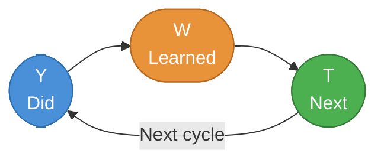

  

# YWT Retrospective

> [!TIP]
> Run this at the end of a sprint or period. Insert today's date with `Ctrl+;`. Use `Ctrl+K` to link resources and references. Archive when done with `Alt+A`.

---

## Session Info

| Field | Detail |
|-------|--------|
| **Period** | [YYYY-MM-DD] – [YYYY-MM-DD] |
| **Sprint / Round** | [Sprint #N] |
| **Participants** | [Name, Name, Name] |
| **Facilitator** | [Name] |

## YWT Cycle

> *Overview — delete this section if not needed.*

---

## Y — What You Did

> List what actually happened during this period. Record objective actions and events without evaluation or opinion.

- [Task or activity completed]
- [Feature or deliverable shipped]
- [Meeting or event attended]
- [Problem or obstacle addressed]
- [Anything else that occurred this period]

---

## W — What You Learned

> Record insights, lessons, and discoveries from your Y entries. Ask "why did this happen?" to go deeper.

- [What went well and why]
- [What didn't go well and the root cause]
- [New discoveries or realizations]
- [Something learned about the team or yourself]
- [A pattern or knowledge to carry forward]

> [!NOTE]
> Reflecting on both successes and failures produces deeper learning.

---

## T — What to Do Next

> Turn your W learnings into concrete actions. Assign an owner and deadline to each.

- [ ] **[Owner]:** [Specific action] — due [YYYY-MM-DD]
- [ ] **[Owner]:** [Specific action] — due [YYYY-MM-DD]
- [ ] **[Owner]:** [Specific action] — due [YYYY-MM-DD]
- [ ] **[Owner]:** [Specific action] — due [YYYY-MM-DD]
- [ ] **[Owner]:** [Specific action] — due [YYYY-MM-DD]

> [!TIP]
> Write actions as "who does what by when" for maximum clarity. Use `Ctrl+;` to insert due dates.

---

## Notes (optional)

> Free space for observations that didn't fit above, carry-forwards for the next retrospective, or reference links.

[Free text]

---

*Captured with Mark It Down*
