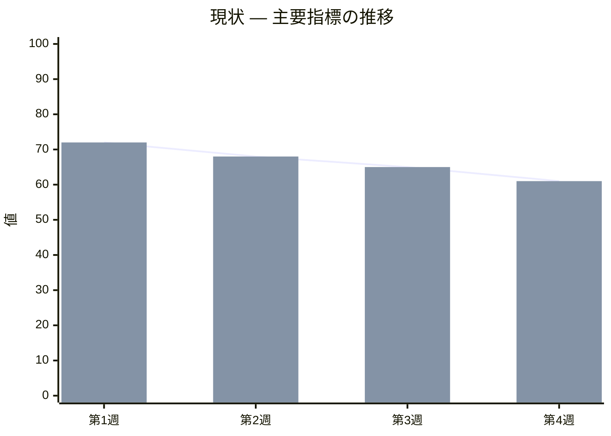
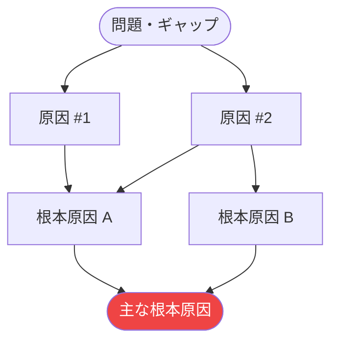
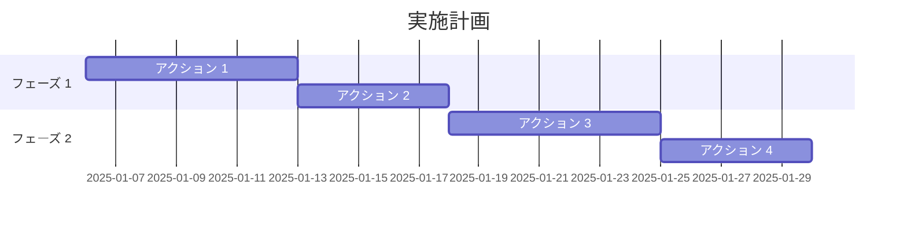

 

# A3レポート

> [!TIP]
> 左から右へ順番に進む：対策を考える前に現状をしっかり把握する。
> `Ctrl+;` で日付を入力、`Ctrl+K` で関連ノートをリンクできる。

---

| 項目 | 内容 |
|------|------|
| **日付** | [YYYY-MM-DD] |
| **担当者** | [氏名またはチーム] |
| **ステータス** | [下書き / 進行中 / 完了] |

---

## ① 背景・テーマ

[なぜこの問題が重要なのかを説明する。初めて読む人が状況を理解できるよう、背景を 1〜3 文で記述する。]

> **テーマ：** [このA3レポートで取り扱う課題を一文で表現する]

---

## ② 現状把握

[現時点の状況を、意見ではなくデータや観察事実で記述する。]

- **確認されたギャップ：** [現状 vs あるべき姿]
- **影響を受けている対象：** [人・システム・プロセス]
- **数値化した影響：** [指標 — 例：「週あたり 3 時間のロス」「エラー率 15 %」]

> *視覚的な概要 — 不要な場合はこのセクションごと削除してください。*

---

## ③ 目標設定

[具体的・測定可能・達成可能・関連性がある・期限付き（SMART）の目標を設定する。]

> **目標：** [YYYY-MM-DD] までに、[測定可能な成果] を達成し、[望ましい影響] を実現する。

**達成基準：**

- [ ] [測定可能な成果 #1]
- [ ] [測定可能な成果 #2]
- [ ] [関係者の承認取得]

---

## ④ 原因分析

[ギャップが生じている *なぜ* を掘り下げる。仮定ではなく証拠に基づいて考察し、② の現状と結びつける。]

> *視覚的な概要 — 不要な場合はこのセクションごと削除してください。*

**根本原因のまとめ：**

- **根本原因 A：** [説明と裏付けとなる証拠]
- **根本原因 B：** [説明と裏付けとなる証拠]

> [!TIP]
> **なぜなぜ分析**テンプレートを使うと、各原因をさらに深掘りできる。

---

## ⑤ 対策立案

[④ で特定した根本原因に直接対処する解決策を列挙する。]

| # | 対策 | 対象の原因 | 期待される効果 | 工数 | 優先度 |
|---|------|-----------|--------------|------|--------|
| 1 | [解決策 A] | [根本原因 A] | [改善の見込み] | [小 / 中 / 大] | [高] |
| 2 | [解決策 B] | [根本原因 B] | [改善の見込み] | [小 / 中 / 大] | [中] |
| 3 | [解決策 C] | [根本原因 A＋B] | [改善の見込み] | [小 / 中 / 大] | [低] |

**採用する対策：** [どの対策を実施するか、その理由]

---

## ⑥ 実施計画

[採用した対策を、担当者と期限が明確な具体的アクションに落とし込む。]

| アクション | 担当者 | 目標日 | 状況 |
|-----------|--------|--------|------|
| [アクション 1] | [氏名] | [YYYY-MM-DD] | [ ] 未着手 |
| [アクション 2] | [氏名] | [YYYY-MM-DD] | [ ] 未着手 |
| [アクション 3] | [氏名] | [YYYY-MM-DD] | [ ] 未着手 |
| [アクション 4] | [氏名] | [YYYY-MM-DD] | [ ] 未着手 |

> *視覚的な概要 — 不要な場合はこのセクションごと削除してください。*

---

## ⑦ 効果確認

[実施後、実績を記録し③ の目標と比較する。]

| 指標 | ベースライン | 目標値 | 実績値 | 差異 |
|------|------------|--------|--------|------|
| [KPI #1] | [値] | [値] | [値] | [値] |
| [KPI #2] | [値] | [値] | [値] | [値] |

**目標を達成できたか？** [はい / 一部達成 / いいえ — 理由を説明する]

**振り返り：**

- [うまくいったこと]
- [次回改善すること]
- [再発防止のための仕組み的な変更]

**次回レビュー日：** [YYYY-MM-DD]

---

*Mark It Downで作成*
