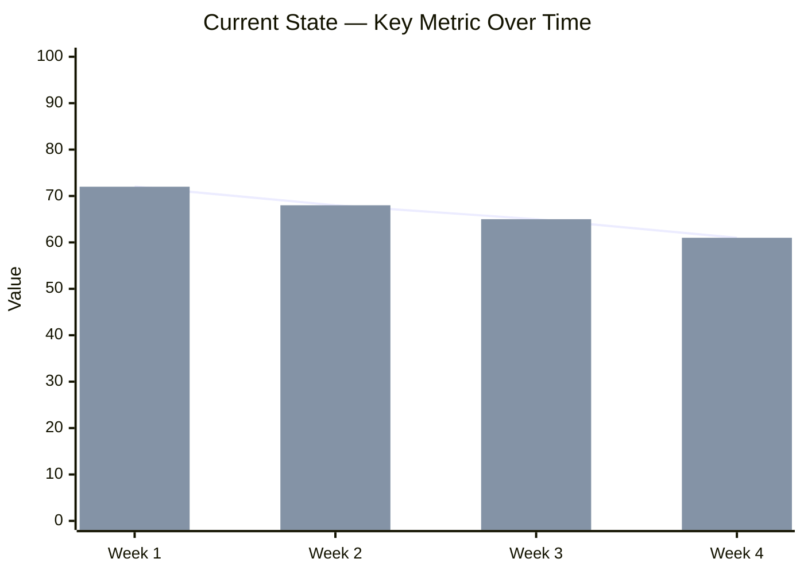
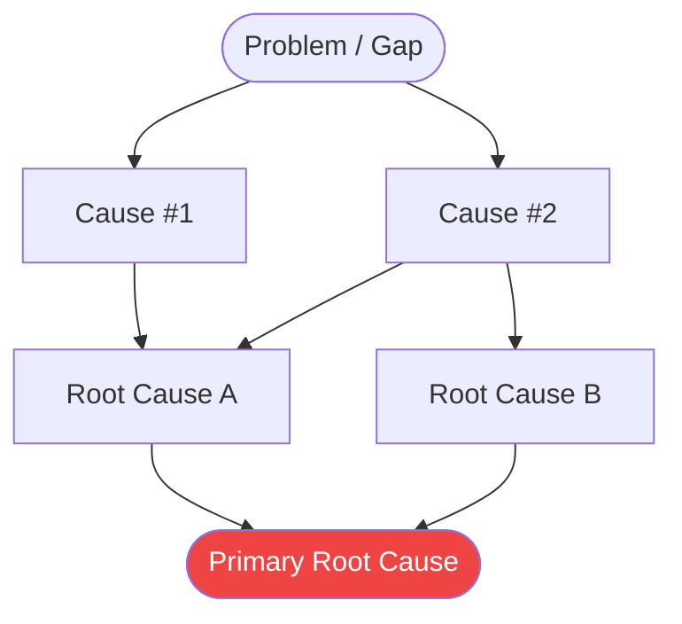
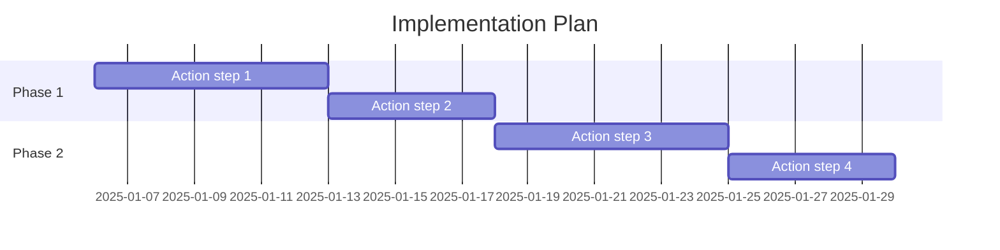

 

# A3 Report

> [!TIP]
> Work left to right: understand the current state before jumping to countermeasures.
> Use `Ctrl+;` to stamp dates and `Ctrl+K` to link related documents.

---

| Field | Value |
|-------|-------|
| **Date** | [YYYY-MM-DD] |
| **Owner** | [Name or team] |
| **Status** | [Draft / In Progress / Complete] |

---

## 1. Background / Theme

[Why does this problem matter? Provide the context a newcomer needs to understand the urgency — 1 to 3 sentences.]

> **Theme:** [One-sentence framing of what this A3 addresses]

---

## 2. Current State

[Describe the situation as it exists today. Use data, observations, or direct evidence — not opinions.]

- **Observed gap:** [What is happening vs. what should be happening]
- **Who is affected:** [People, systems, or processes impacted]
- **Quantified impact:** [Metric — e.g., "3 hours lost per week", "15 % error rate"]

> *Visual overview — delete this section if not needed.*

---

## 3. Goal

[State a specific, measurable, achievable, relevant, and time-bound (SMART) goal.]

> **Goal:** By [YYYY-MM-DD], [measurable outcome] so that [desired impact].

**Success criteria:**

- [ ] [Measurable outcome #1]
- [ ] [Measurable outcome #2]
- [ ] [Stakeholder sign-off obtained]

---

## 4. Root Cause Analysis

[Dig into *why* the gap exists. Use evidence, not assumptions. Connect causes to the current state you described above.]

> *Visual overview — delete this section if not needed.*

**Root cause summary:**

- **Root Cause A:** [Explanation, with supporting evidence]
- **Root Cause B:** [Explanation, with supporting evidence]

> [!TIP]
> Use the **Five Whys Analysis** template to drill deeper into each cause.

---

## 5. Countermeasures

[List proposed solutions that directly address the root causes identified above.]

| # | Countermeasure | Addresses | Expected Effect | Effort | Priority |
|---|----------------|-----------|-----------------|--------|----------|
| 1 | [Solution A] | [Root Cause A] | [Anticipated improvement] | [Low / Medium / High] | [High] |
| 2 | [Solution B] | [Root Cause B] | [Anticipated improvement] | [Low / Medium / High] | [Medium] |
| 3 | [Solution C] | [Root Cause A + B] | [Anticipated improvement] | [Low / Medium / High] | [Low] |

**Selected approach:** [Which countermeasure(s) will be implemented, and why]

---

## 6. Implementation Plan

[Break selected countermeasures into concrete action items with clear owners and deadlines.]

| Action | Owner | Target Date | Status |
|--------|-------|-------------|--------|
| [Action step 1] | [Name] | [YYYY-MM-DD] | [ ] Not started |
| [Action step 2] | [Name] | [YYYY-MM-DD] | [ ] Not started |
| [Action step 3] | [Name] | [YYYY-MM-DD] | [ ] Not started |
| [Action step 4] | [Name] | [YYYY-MM-DD] | [ ] Not started |

> *Visual overview — delete this section if not needed.*

---

## 7. Follow-up / Verification

[After implementation, record actual results and compare them against the goal.]

| Metric | Baseline | Target | Actual | Gap |
|--------|----------|--------|--------|-----|
| [KPI #1] | [Value] | [Value] | [Value] | [Value] |
| [KPI #2] | [Value] | [Value] | [Value] | [Value] |

**Did we achieve the goal?** [Yes / Partially / No — explain]

**Lessons learned:**

- [What worked well]
- [What to do differently next time]
- [Systemic change to prevent recurrence]

**Next review date:** [YYYY-MM-DD]

---

*Captured with Mark It Down*
