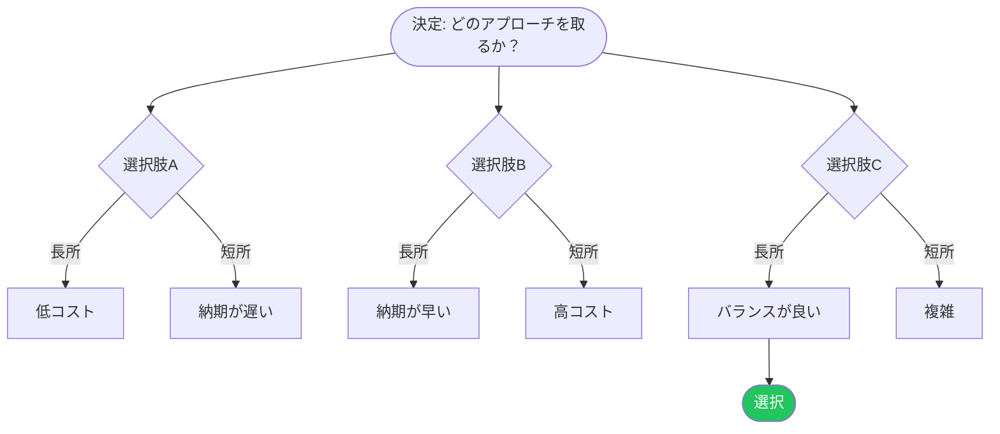

 

# 意思決定ログ

> [!TIP]
> 決定は後からではなく、その場で記録しましょう。まずコンテキストと選択肢を記入。
> `Ctrl+;` で日付を記録、`Ctrl+K` で関連する決定を検索。

---

## 決定メタデータ

| 項目 | 値 |
|------|-----|
| **日付** | [YYYY-MM-DD] |
| **決定者** | [名前またはチーム] |
| **ステータス** | [提案中 / 承認済み / 置き換え済み / 非推奨] |
| **関連する決定** | [リンクまたは参照（あれば）] |

## コンテキスト

[どんな状況や問題がこの決定のきっかけになったか？将来の読者に必要な背景情報を含めてください。]

## 選択肢

| 選択肢 | 長所 | 短所 | 工数 |
|--------|------|------|------|
| **A — [名前]** | [利点] | [欠点] | [低 / 中 / 高] |
| **B — [名前]** | [利点] | [欠点] | [低 / 中 / 高] |
| **C — [名前]** | [利点] | [欠点] | [低 / 中 / 高] |

### 選択肢A — [名前]

[テーブルでは足りない場合の簡単な説明]

### 選択肢B — [名前]

[簡単な説明]

### 選択肢C — [名前]

[簡単な説明]

> [!NOTE]
> [検討して早い段階で却下した選択肢があれば、一行の理由と共に記載。]

## 決定ツリー

> *全体像 ― 不要なら削除してください。*

## 選択した選択肢

**選択肢 [A/B/C] — [名前]**

## 根拠

[なぜこの選択肢が他より選ばれたか。上のテーブルの具体的な長所/短所を参照。]

> [決定を後押しした重要な引用、データ、または原則]

反対意見または受け入れたリスク

[この選択に関する意見の相違や、受け入れた既知のトレードオフを記録。]

## レビュー日

**再検討日:** [YYYY-MM-DD またはトリガーイベント、例: 「Q3の結果後」]

---

*Mark It Downで作成*
