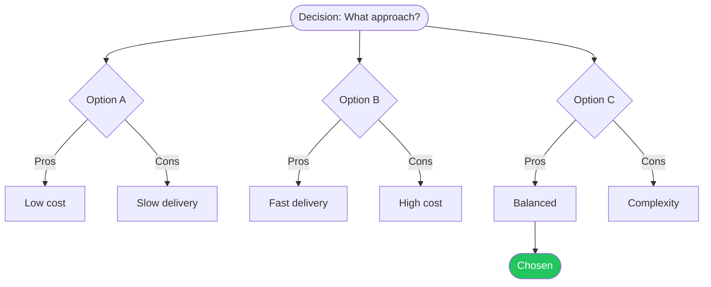

 

# Decision Log

> [!TIP]
> Document decisions when they are made, not after. Fill in Context and Options first.
> Use `Ctrl+;` to stamp the date and `Ctrl+K` to find related decisions.

---

## Decision Metadata

| Field | Value |
|-------|-------|
| **Date** | [YYYY-MM-DD] |
| **Decision maker** | [Name or team] |
| **Status** | [Proposed / Accepted / Superseded / Deprecated] |
| **Related decisions** | [Link or reference, if any] |

## Context

[What situation or problem prompted this decision? Include relevant background that a future reader would need.]

## Options

| Option | Pros | Cons | Effort |
|--------|------|------|--------|
| **A — [Name]** | [Advantage] | [Disadvantage] | [Low / Medium / High] |
| **B — [Name]** | [Advantage] | [Disadvantage] | [Low / Medium / High] |
| **C — [Name]** | [Advantage] | [Disadvantage] | [Low / Medium / High] |

### Option A — [Name]

[Brief description if the table is not enough]

### Option B — [Name]

[Brief description]

### Option C — [Name]

[Brief description]

> [!NOTE]
> [Any option that was considered and quickly ruled out, with a one-line reason why.]

## Decision Tree

> *Visual overview — delete this section if not needed.*

## Chosen Option

**Option [A/B/C] — [Name]**

## Rationale

[Why this option was selected over the others. Reference specific pros/cons from the table above.]

> [Key quote, data point, or principle that drove the decision]

Dissenting opinions or risks accepted

[Record any disagreements or known trade-offs accepted with this choice.]

## Review Date

**Revisit by:** [YYYY-MM-DD or trigger event, e.g., "after Q3 results"]

---

*Captured with Mark It Down*
