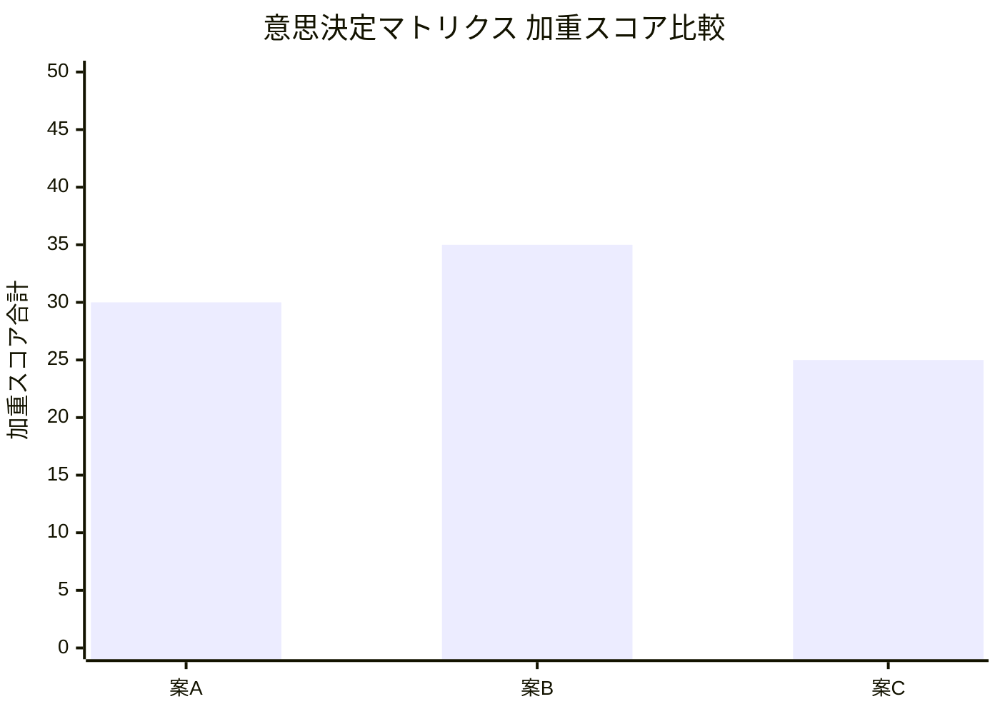

 

# 意思決定マトリクス

> [!TIP]
> `Ctrl+;` で日付を挿入。関連する意思決定ログやRFCは `Ctrl+K` でリンク。
> 重みの設定が意思決定の本質。スコアより重みの議論に時間をかける。

---

## メタ情報

| 項目 | 内容 |
|------|------|
| **意思決定テーマ** | [何を決めるか？] |
| **決定期限** | [YYYY-MM-DD] |
| **意思決定者** | [名前] |
| **関与者** | [名前] |
| **作成日** | [YYYY-MM-DD] |

## 背景・制約条件

> なぜ今この意思決定が必要か。外せない制約条件は何か。

[状況と譲れない制約を記述]

## 評価基準と重み

| # | 評価基準 | 重み（合計10） | 設定理由 |
|---|---------|--------------|---------|
| C1 | [基準名] | [重み] | [この重みにした理由] |
| C2 | [基準名] | [重み] | [この重みにした理由] |
| C3 | [基準名] | [重み] | [この重みにした理由] |
| C4 | [基準名] | [重み] | [この重みにした理由] |
| **合計** | | **10** | |

## 選択肢の定義

| 選択肢 | 概要 | 前提条件 |
|--------|------|---------|
| 案A | [説明] | [主な前提] |
| 案B | [説明] | [主な前提] |
| 案C | [説明] | [主な前提] |

## 評価マトリクス

> スコア: 1（低）〜 5（高）　加重スコア = スコア × 重み

| 評価基準 | 重み | 案A スコア | 案A 加重 | 案B スコア | 案B 加重 | 案C スコア | 案C 加重 |
|---------|------|-----------|---------|-----------|---------|-----------|---------|
| [C1] | [W1] | | | | | | |
| [C2] | [W2] | | | | | | |
| [C3] | [W3] | | | | | | |
| [C4] | [W4] | | | | | | |
| **合計** | **10** | | **[合計A]** | | **[合計B]** | | **[合計C]** |

## スコア可視化

> *全体像 ― 不要なら削除してください。*

## センシティビティ分析

> 重みを変えたら結果は変わるか？

| シナリオ | 変更内容 | 結果 |
|---------|---------|------|
| ベースライン | 上記重みのまま | 案[X]が最高スコア |
| シナリオ2 | [C1]の重みを+2、[C4]を-2 | [結果] |
| シナリオ3 | [C2]と[C3]の重みを均等に | [結果] |

> [!NOTE]
> センシティビティ分析で結果が変わる場合、重み設定の議論が意思決定の本質になる。

## 最終決定

**選択した案:** 案[X]

**決定理由:**

> [なぜこの選択肢を選んだか — スコアと主要基準を参照]

**リスク・懸念事項と対策:**

| リスク | 対策 |
|--------|------|
| [特定されたリスク] | [対処法] |

**この決定を見直すトリガー条件:**

> [何が起きたら再検討するか — 例: 指標の閾値、スケジュール遅延]

## 決定履歴

| 日付 | 内容 | 決定者 |
|------|------|--------|
| [YYYY-MM-DD] | 初回評価・案[X]を選定 | [名前] |

---

*Mark It Downで作成*
