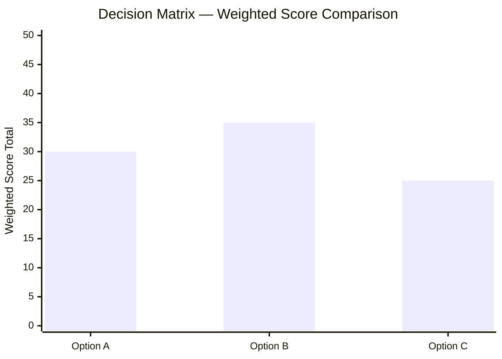

 

# Decision Matrix

> [!TIP]
> Use `Ctrl+;` to insert dates. Link related decision logs or RFCs with `Ctrl+K`.
> Focus on getting the weights right — that's where the real decision-making happens.

---

## Metadata

| Field | Value |
|-------|-------|
| **Decision Topic** | [What are we deciding?] |
| **Deadline** | [YYYY-MM-DD] |
| **Decision Maker** | [Name] |
| **Stakeholders** | [Names] |
| **Created** | [YYYY-MM-DD] |

## Background & Constraints

> Why is this decision needed now? What constraints are non-negotiable?

[Describe the context and hard constraints]

## Evaluation Criteria & Weights

| # | Criterion | Weight (total 10) | Rationale |
|---|----------|-------------------|-----------|
| C1 | [Criterion name] | [Weight] | [Why this weight] |
| C2 | [Criterion name] | [Weight] | [Why this weight] |
| C3 | [Criterion name] | [Weight] | [Why this weight] |
| C4 | [Criterion name] | [Weight] | [Why this weight] |
| **Total** | | **10** | |

## Options

| Option | Summary | Assumptions |
|--------|---------|-------------|
| Option A | [Description] | [Key assumptions] |
| Option B | [Description] | [Key assumptions] |
| Option C | [Description] | [Key assumptions] |

## Evaluation Matrix

> Score: 1 (low) – 5 (high). Weighted = Score × Weight.

| Criterion | Weight | A Score | A Weighted | B Score | B Weighted | C Score | C Weighted |
|-----------|--------|---------|-----------|---------|-----------|---------|-----------|
| [C1] | [W1] | | | | | | |
| [C2] | [W2] | | | | | | |
| [C3] | [W3] | | | | | | |
| [C4] | [W4] | | | | | | |
| **Total** | **10** | | **[Total A]** | | **[Total B]** | | **[Total C]** |

## Score Visualization

> *Visual overview — delete this section if not needed.*

## Sensitivity Analysis

> What happens if the weights change?

| Scenario | Change | Result |
|----------|--------|--------|
| Baseline | Weights as above | Option [X] highest |
| Scenario 2 | [C1] +2, [C4] -2 | [Result] |
| Scenario 3 | [C2] and [C3] equal weight | [Result] |

> [!NOTE]
> If the result flips under different weights, the weight discussion itself is the core decision.

## Final Decision

**Chosen option:** Option [X]

**Rationale:**

> [Why this option was selected — reference the scores and key criteria]

**Risks & Mitigations:**

| Risk | Mitigation |
|------|-----------|
| [Identified risk] | [How to address it] |

**Trigger to revisit this decision:**

> [What would make us reconsider — e.g., metric threshold, timeline miss]

## Decision History

| Date | Change | Decision Maker |
|------|--------|---------------|
| [YYYY-MM-DD] | Initial evaluation — selected Option [X] | [Name] |

---

*Captured with Mark It Down*
