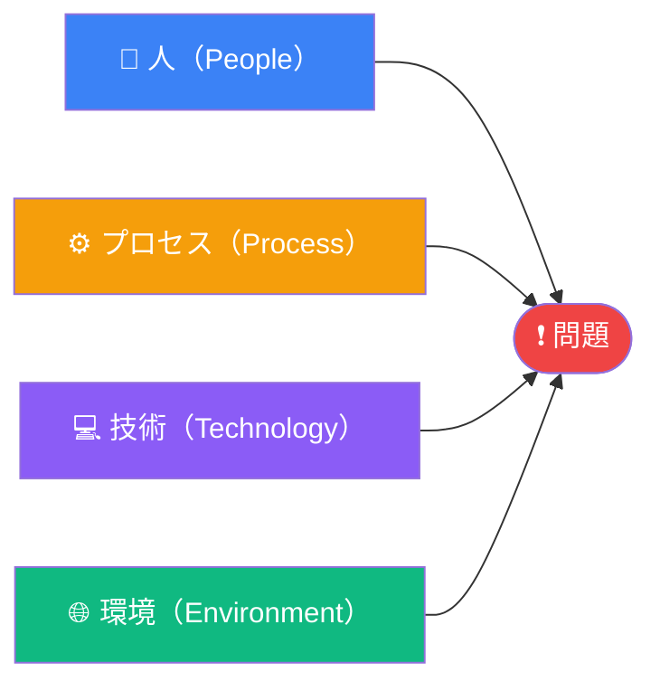

  

# 特性要因図（フィッシュボーン）

> [!TIP]
> 問題から逆向きに考えましょう。各カテゴリで「この領域の何が問題を引き起こしているか？」と問いかけます。
> `Ctrl+;` でセッションの日時を記録、`Ctrl+K` で関連ノートやチケットをリンク。

---

## 問題の定義

[調査する結果・問題を記述してください。曖昧な表現を避け、具体的かつ測定可能な形で書きましょう。]

> **問題:** [望ましくない結果を一文で表現]

**発生確認日:** [日付または期間]
**影響範囲:** [誰が・何が・どの程度影響を受けているか]

## 特性要因図

> *全体像 ― 不要なら削除してください。*

## カテゴリ別分析

### 人（People）

[着目点: スキル・知識・コミュニケーション・作業負荷・モチベーション・研修・チーム構成]

- **[原因 1]** — [問題への関与について簡単に説明]
- **[原因 2]** — [簡単な説明]
- **[原因 3]** — [簡単な説明]

### プロセス（Process）

[着目点: ワークフロー・手順・作業ステップ・引き継ぎ・承認・方針・標準・ドキュメント]

- **[原因 1]** — [簡単な説明]
- **[原因 2]** — [簡単な説明]
- **[原因 3]** — [簡単な説明]

### 技術（Technology）

[着目点: ツール・システム・ソフトウェア・連携・信頼性・設定・データ品質]

- **[原因 1]** — [簡単な説明]
- **[原因 2]** — [簡単な説明]
- **[原因 3]** — [簡単な説明]

### 環境（Environment）

[着目点: 作業場所・リモート/オフィス・組織文化・外部からのプレッシャー・時間的制約]

- **[原因 1]** — [簡単な説明]
- **[原因 2]** — [簡単な説明]
- **[原因 3]** — [簡単な説明]

## 優先原因の整理

全カテゴリから、最も可能性が高い・影響度の大きい原因を抽出します。

| 原因 | カテゴリ | 影響度 | 根拠 | 担当者 |
|------|----------|--------|------|--------|
| [原因] | 人 / プロセス / 技術 / 環境 | 高 / 中 / 低 | [データまたは観察事項] | [氏名] |
| [原因] | | | | |
| [原因] | | | | |

## 根本原因の仮説

[上記の分析をもとに、根本原因として最も有力な仮説を記述してください。フィッシュボーンはブレインストーミングツールです。なぜなぜ分析などと組み合わせてデータで検証しましょう。]

> **仮説:** [証拠に基づいた最有力の根本原因]

## 次のアクション

- [ ] 最上位の原因をデータまたは実験で検証する: [方法を記述]
- [ ] 各優先原因の調査担当者をアサインする
- [ ] 最も影響度の高い原因に対してなぜなぜ分析を実施する
- [ ] フォローアップレビューをスケジュールする: [YYYY-MM-DD]
- [ ] 調査結果を文書化してステークホルダーと共有する

*Mark It Downで作成*
