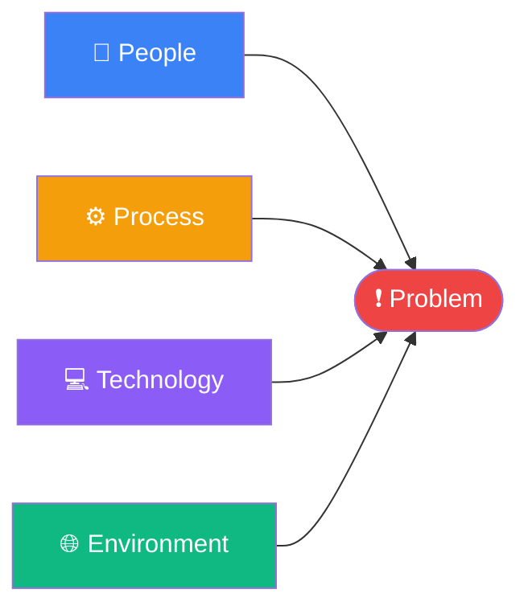

  

# Fishbone Diagram (Ishikawa / Cause-and-Effect)

> [!TIP]
> Work backwards from the problem. For each category, ask "What in this area could cause the problem?"
> Use `Ctrl+;` to timestamp your session and `Ctrl+K` to link related notes or tickets.

---

## Problem Statement

[Describe the effect or problem you are investigating. Be specific and measurable — avoid vague language.]

> **Problem:** [One-sentence statement of the undesired outcome]

**Observed since:** [Date or timeframe]
**Impact:** [Who or what is affected, and how severely]

## Cause-and-Effect Diagram

> *Visual overview — delete this section if not needed.*

## Category Analysis

### People

[Consider: skills, knowledge, communication, workload, motivation, training, team structure]

- **[Cause 1]** — [Brief explanation of how this contributes to the problem]
- **[Cause 2]** — [Brief explanation]
- **[Cause 3]** — [Brief explanation]

### Process

[Consider: workflows, procedures, steps, handoffs, approvals, policies, standards, documentation]

- **[Cause 1]** — [Brief explanation]
- **[Cause 2]** — [Brief explanation]
- **[Cause 3]** — [Brief explanation]

### Technology

[Consider: tools, systems, software, integrations, reliability, configuration, data quality]

- **[Cause 1]** — [Brief explanation]
- **[Cause 2]** — [Brief explanation]
- **[Cause 3]** — [Brief explanation]

### Environment

[Consider: physical space, remote vs. in-office, organizational culture, external pressures, time constraints]

- **[Cause 1]** — [Brief explanation]
- **[Cause 2]** — [Brief explanation]
- **[Cause 3]** — [Brief explanation]

## Priority Causes

Identify the most likely or high-impact causes across all categories.

| Cause | Category | Impact | Evidence | Owner |
|-------|----------|--------|----------|-------|
| [Cause] | People / Process / Technology / Environment | High / Medium / Low | [Data or observation] | [Name] |
| [Cause] | | | | |
| [Cause] | | | | |

## Root Cause Hypothesis

[Based on the analysis above, state your leading hypothesis for the root cause. A fishbone is a brainstorming tool — combine it with data (e.g., Five Whys) to confirm.]

> **Hypothesis:** [Most likely root cause, supported by evidence]

## Next Steps

- [ ] Validate the top cause with data or experiment: [describe how]
- [ ] Assign investigation owners for each priority cause
- [ ] Run a Five Whys on the highest-impact cause
- [ ] Schedule a follow-up review: [YYYY-MM-DD]
- [ ] Document findings and share with stakeholders

*Captured with Mark It Down*
