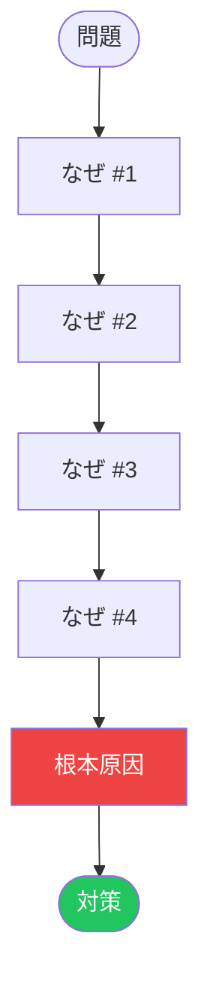

 

# なぜなぜ分析

> [!TIP]
> 「なぜ？」を最大5回繰り返しましょう。各回答が次の質問の入力になります。
> `Ctrl+;` で分析日を記録、`Ctrl+K` で関連ノートを検索。

---

## 問題の説明

[観察された問題を事実に基づき、具体的に記述してください。責任の追及や推測は避けましょう。]

> **問題:** [一文のサマリー]

## 原因の連鎖

> *全体像 ― 不要なら削除してください。*

## なぜ #1

**なぜ[問題]が発生するのか？**

> [回答 #1 — 最も直接的な原因を述べる]

## なぜ #2

**なぜ[回答 #1]が起きるのか？**

> [回答 #2 — 一段深く掘り下げる]

例えば、問題が「毎週金曜日にデプロイが失敗する」場合:

- なぜ #1: 「CIパイプラインがタイムアウトする」[^1]
- なぜ #2: 「インテグレーションテストが金曜日に高負荷になる共有ステージングデータベースに対して実行される」

## なぜ #3

**なぜ[回答 #2]が起きるのか？**

> [回答 #3]

## なぜ #4

**なぜ[回答 #3]が起きるのか？**

> [回答 #4]

## なぜ #5

**なぜ[回答 #4]が起きるのか？**

> [回答 #5 — これが多くの場合、根本原因です]

> [!TIP]
> 必ずしも5段階すべてが必要ではありません。行動可能な答えにたどり着いたら止めましょう。

## 根本原因

[上記の分析で特定された根本原因をまとめてください。]

## 対策

- [ ] [根本原因に対処するアクション]
- [ ] [再発を防ぐアクション]
- [ ] [問題を早期に検知するアクション]
- [ ] [担当者と期限を割り当て]

## 検証計画

**根本原因が正しいことをどう確認するか？**

- [検証する実験、指標、または観察]

**修正が機能することをどう確認するか？**

- [成功指標または受け入れテスト]

**レビュー日:** [YYYY-MM-DD]

[^1]: 各「なぜ」は推測ではなく、証拠に基づくべきです。

*Mark It Downで作成*
