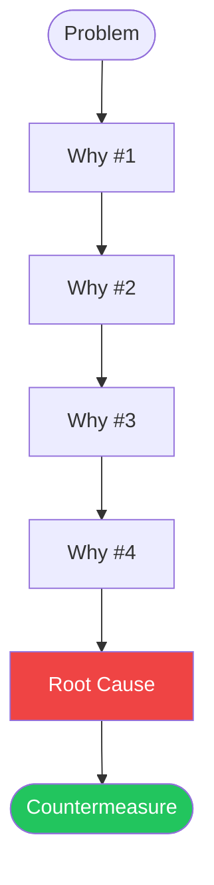

 

# Five Whys Analysis

> [!TIP]
> Ask "Why?" up to five times. Each answer becomes the input for the next question.
> Use `Ctrl+;` to date your analysis and `Ctrl+K` to find related notes.

---

## Problem Description

[Describe the observed problem in factual, specific terms. Avoid blame or assumptions.]

> **Problem:** [One-sentence summary]

## Cause Chain

> *Visual overview — delete this section if not needed.*

## Why #1

**Why does [the problem] occur?**

> [Answer #1 — state the most direct cause]

## Why #2

**Why does [answer #1] happen?**

> [Answer #2 — dig one level deeper]

For example, if the problem is "deployments fail every Friday":

- Why #1: "The CI pipeline times out." [^1]
- Why #2: "Integration tests run against a shared staging database that is under heavy load on Fridays."

## Why #3

**Why does [answer #2] happen?**

> [Answer #3]

## Why #4

**Why does [answer #3] happen?**

> [Answer #4]

## Why #5

**Why does [answer #4] happen?**

> [Answer #5 — this is often the root cause]

> [!TIP]
> You do not always need all five levels. Stop when the answer points to something you can act on.

## Root Cause

[Summarize the root cause identified through the analysis above.]

## Countermeasures

- [ ] [Action to address the root cause]
- [ ] [Action to prevent recurrence]
- [ ] [Action to detect the problem earlier]
- [ ] [Assign owner and due date]

## Verification Plan

**How will we confirm the root cause is correct?**

- [Experiment, metric, or observation to validate]

**How will we confirm the fix works?**

- [Success metric or acceptance test]

**Review date:** [YYYY-MM-DD]

[^1]: Each "Why" should be supported by evidence, not speculation.

*Captured with Mark It Down*
